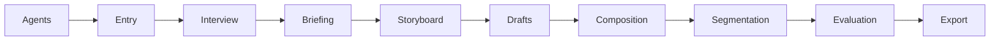

<div align="center">

# Post Engine

**An authorship-first editorial machine.**

Generic AI writes fluent emptiness.  
This engine refuses to invent your life — it interviews you until the material is real enough to publish.

[](https://www.python.org/)
[](https://react.dev/)
[](pyproject.toml)


</div>

<details>
<summary><strong>Português</strong> — clique para expandir</summary>

<br />

<div align="center">

# Post Engine

**Uma máquina editorial centrada em autoria.**

IA genérica escreve vazio fluente.  
Esta engine recusa inventar a sua vida — ela te entrevista até o material ser real o bastante para publicar.

</div>

### Por que existe

Conteúdo gerado por modelo sem vivência, opinião e voz soa impecável — e descartável.

O Post Engine inverte a ordem:

1. Extrai material humano por entrevista adaptativa
2. Avalia autoria com um gateway híbrido (LLM + heurística)
3. Só então gera, segmenta e exporta

Premissa central: ausência de experiência nunca vira falsa vivência.

### A máquina



Dez estágios na workstation: roteamento de agentes → intenção → entrevista → briefing autoral → storyboard → rascunhos → composição → segmentação → avaliação → exportação.

### Gateway de autoria

Aprovação exige **dois** vereditos ao mesmo tempo — o LLM sozinho não libera nada.

| Caminho | Ideia |
|---------|--------|
| `EQUILIBRADO` | Dimensões essenciais cobertas com equilíbrio |
| `DESEQUILIBRADO_FORTE` | Material excepcional concentrado, com pisos críticos |
| `REPROVADO` | Lacunas, vetos ou desacordo LLM/heurística |

Perfis de gateway variam por formato (`post`, `article`, `short_carousel`, `long_slide`). Vetos absolutos bloqueam experiência inventada ou não confirmada.

### Ofício de engenharia

- **Workspace LLM isolado** — cada chamada roda em um workspace temporário com allowlist; o agente não engole o repositório inteiro
- **Roteamento por fase** — Codex, OpenCode ou Cursor, com modelo e sandbox por operação
- **Editorial multi-etapa** — storyboard → abordagens/rascunhos → composição (não é geração one-shot)
- **Prompts como contratos** — operações editoriais versionadas em Markdown sob `prompts/`

### Formatos e exportação

| Formato | Uso |
|---------|-----|
| `post` | Peça autoral de feed |
| `article` | Texto longo |
| `short_carousel` | 4–8 slides |
| `long_slide` | 9+ slides |

Exportação em Markdown; trilhas visuais também podem sair como SlideMark JSON após a avaliação.

### Quick start

**Pré-requisitos:** Python ≥ 3.11, [uv](https://github.com/astral-sh/uv), [pnpm](https://pnpm.io/), e um agente CLI configurado (Codex / OpenCode / Cursor).

```fish
# Build do frontend + sync + GUI (recomendado)
./scripts/gui.fish
```

```bash
# Ou manualmente
cd frontend && pnpm install && pnpm run build && cd ..
uv sync
uv run python -m content_engine --gui
```

Abre em `http://127.0.0.1:8765` (`--gui-host` / `--gui-port` para sobrescrever).

### Mapa do repositório

| Path | Papel |
|------|--------|
| `src/content_engine/` | Domínio: entrevista, editorial, LLM, persistência |
| `src/gui/` | Servidor HTTP da workstation |
| `frontend/` | React 19 + Vite + TypeScript + Tailwind 4 |
| `prompts/` | Contratos editoriais e de entrevista |
| `tests/` | Pytest + fixtures de qualidade |

### Filosofia

> Humanos nem sempre falam só do que viveram.  
> O sistema nunca deve transformar ausência de experiência em falsa vivência.

---

</details>

---

## Why it exists

Model-generated content without lived experience, opinion, and voice reads polished — and disposable.

Post Engine reverses the order of operations:

1. Extract human material through an adaptive interview
2. Score authorship with a hybrid gateway (LLM + deterministic heuristic)
3. Only then generate, segment, and export

The central premise: absence of experience must never become fabricated experience.

---

## The machine


Ten stages in the workstation pipeline: agent routing → intent → interview → authorship briefing → storyboard → drafts → composition → segmentation → evaluation → export.

Inside the interview loop: open exploration → answer → signal extraction → hybrid gateway → gap analysis → deepen when needed → close when the material holds.

---

## Authorship gateway

Approval requires **both** verdicts at once — the LLM alone cannot greenlight generation.

| Path | Intent |
|------|--------|
| `EQUILIBRADO` | Essential dimensions covered with balance |
| `DESEQUILIBRADO_FORTE` | Exceptional concentrated material, with critical floors intact |
| `REPROVADO` | Gaps, vetoes, or LLM/heuristic disagreement |

Gateway profiles are format-specific (`post`, `article`, `short_carousel`, `long_slide`). Absolute vetoes block invented or unconfirmed lived experience.

---

## Engineering craft

- **Isolated LLM workspace** — each agent call runs in a temporary allowlisted workspace; the model does not swallow the entire repository
- **Per-phase routing** — Codex, OpenCode, or Cursor, with model and sandbox chosen per operation
- **Multi-step editorial** — storyboard → approaches/drafts → composition (not a single-shot prompt)
- **Prompts as contracts** — editorial and interview operations versioned as Markdown under `prompts/`

Built as a local editorial machine — intentional, early (`0.1.0`), and serious about epistemic integrity.

---

## Formats & export

| Format | Role |
|--------|------|
| `post` | Feed-native authorship piece |
| `article` | Long-form text |
| `short_carousel` | 4–8 slides |
| `long_slide` | 9+ slides |

Always export Markdown. Visual tracks can also emit SlideMark JSON after evaluation.

---

## Quick start

**Prerequisites:** Python ≥ 3.11, [uv](https://github.com/astral-sh/uv), [pnpm](https://pnpm.io/), and a configured agent CLI (Codex / OpenCode / Cursor).

```fish
# Build frontend + sync + launch GUI (recommended)
./scripts/gui.fish
```

```bash
# Or step by step
cd frontend && pnpm install && pnpm run build && cd ..
uv sync
uv run python -m content_engine --gui
```

Serves at `http://127.0.0.1:8765` (override with `--gui-host` / `--gui-port`).

---

## Repository map

| Path | Role |
|------|------|
| `src/content_engine/` | Domain: interview, editorial, LLM, persistence |
| `src/gui/` | HTTP server for the workstation |
| `frontend/` | React 19 + Vite + TypeScript + Tailwind 4 |
| `prompts/` | Editorial and interview contracts |
| `tests/` | Pytest + quality fixtures |

---

## Philosophy

> Humans do not always speak only of what they lived.  
> The system must never turn absence of experience into false experience.
