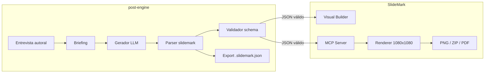

# Plano: alinhar output do post-engine ao SlideMark JSON v1

## Resumo executivo

O **post-engine** gera conteúdo autoral via entrevista + LLM. As trilhas visuais (`short_carousel`, `long_slide`) passam a emitir documentos **SlideMark JSON v1** — o mesmo contrato usado pelo app SlideMark e pelo servidor MCP local.

**Estado atual (após esta rodada):**
- Prompts de geração, regras, personas, entrevista e avaliação atualizados para SlideMark v1.
- `generator.py` parseia o campo `slidemark` e mantém compatibilidade com o formato legado `slides[]`.
- Exportador e TUI propagam `slidemark` no `conteudo_json`.

**Próximos passos:** validação de schema, export dedicado `.slidemark.json`, integração MCP e testes automatizados.

---

## 1. Como o SlideMark funciona

### 1.1 Modelo de dados

O SlideMark é um documento JSON versionado (`1.0.0`) com:

| Seção | Função |
|---|---|
| `document` | Metadados: título, descrição, idioma (`pt-BR` \| `en-US`) |
| `canvas` | Fixo `1080×1080` (carrossel quadrado) |
| `theme` | Um de 9 temas oficiais |
| `author` | Nome, handle (`@...`), avatar opcional |
| `settings` | Rodapé: autor, numeração, hint de swipe |
| `export` | Nome do arquivo, formatos (`png`, `zip`, `pdf`), config PDF |
| `slides[]` | Lista de slides tipados por discriminated union |

**Fonte de verdade:** `SlideMark/src/core/schema/slidemark.schema.ts` (Zod).

### 1.2 Tipos de slide (templates)

| `type` | Uso |
|---|---|
| `cover.hero` | **Obrigatório no 1º slide** — hook, subtítulo, CTA opcional |
| `content.text` | Parágrafos + destaque (`highlight`) + ênfases |
| `content.code` | Snippet com linguagem, até **14 linhas** |
| `content.bullets` | Lista (máx. 4–6 itens conforme trilha) |
| `content.compare` | Antes/depois, certo/errado, prós/contras |
| `content.image` | Imagem com `media.src` |
| `content.screenshot` | Screenshot com frame e anotações |
| `closing.cta` | **Obrigatório no último slide** — CTA de engajamento |

Cada slide tem `variant`: `alpha`, `bravo` ou `charlie` (layout visual distinto, mesmos dados).

### 1.3 Pipeline no SlideMark

```
JSON v1 → parseSlideMarkDocument (Zod)
       → ThemeProvider + SlideRenderer (React)
       → Preview no Visual Builder / Legacy Editor
       → Export PNG / ZIP / PDF (capture via DOM 1080×1080)
```

### 1.4 MCP (Model Context Protocol)

Servidor local em `SlideMark/src/mcp/server.ts` (`stdio`):

| Recurso / Tool | Função |
|---|---|
| `slidemark://contract/v1` | Contrato para agentes |
| `slidemark://schema/enums` | Temas, tipos, variantes |
| `slidemark://examples/{id}` | Exemplos oficiais |
| `validate_slidemark_json` | Valida JSON contra schema |
| `export_slidemark` | Renderiza e grava PNG/ZIP/PDF |
| Prompt `create_slidemark_carousel` | Monta prompt a partir do contrato |

**Contrato humano:** `SlideMark/docs/slidemark-agent-contract-v1.md`

O post-engine deve gerar JSON que passe em `validate_slidemark_json` sem pós-processamento manual.

---

## 2. Como o post-engine funcionava (antes)

### 2.1 Fluxo editorial

```
Entrada (tema, plataforma, objetivo)
  → Entrevista autoral (5 aspectos)
  → Gateway de aprovação
  → Briefing autoral
  → Geração (prompt base + persona + regras + briefing)
  → Avaliação autoral
  → Export MD + JSON legado
```

### 2.2 Formato de saída legado (trilhas visuais)

```json
{
  "slides": [
    { "numero": 1, "titulo": "...", "bullets": ["..."], "notasVisuais": "..." }
  ],
  "conteudo": "texto plano",
  "metadados": { "totalSlides": 5 },
  "alertas": []
}
```

**Problemas:**
- Sem tipagem de template (`cover.hero`, `content.code`, etc.).
- Bullets genéricos em todos os slides — não mapeia para o renderer SlideMark.
- Sem envelope de documento (tema, autor, export).
- `notasVisuais` era livre; não estruturava layout.
- JSON legado não era colável no SlideMark.

### 2.3 Código afetado

| Arquivo | Papel |
|---|---|
| `generator.py` | Parse de `slides[]` → `SlideContent` |
| `exporter.py` | Export JSON legado |
| `tui/app.py` | `slides_gerados`, `conteudo_json` |
| `segmentation.py` | `segment-slides.md` (ainda no formato legado) |
| `post_evaluation.py` | Avalia `conteudo` texto |

---

## 3. Formato de saída alvo (post-engine → SlideMark)

### 3.1 Envelope da resposta LLM

```json
{
  "slidemark": { /* documento SlideMark v1 completo */ },
  "conteudo": "resumo slide a slide para avaliação autoral",
  "metadados": {
    "tipoDePost": "short_carousel",
    "plataforma": "LinkedIn",
    "personaUsada": "DevInterlocutorShortCarousel",
    "totalSlides": 6,
    "regraMental": "Uma ideia explicada visualmente.",
    "slideMarkVersion": "1.0.0"
  },
  "alertas": []
}
```

- **`slidemark`**: colável direto no SlideMark ou validável via MCP.
- **`conteudo`**: texto para `PostEvaluator` (não muda o pipeline de avaliação).
- **`metadados` / `alertas`**: mantidos para compatibilidade com TUI e logs.

### 3.2 Mapeamento editorial → SlideMark

#### Carrossel curto (`short_carousel`, 4–8 slides)

| Ordem | Papel | Template |
|---|---|---|
| 1 | Hook | `cover.hero` |
| 2 | Problema / contexto | `content.text` |
| 3 | Explicação ou lista | `content.text` ou `content.bullets` |
| 4 | Exemplo | `content.code` ou `content.compare` |
| 5 | Insight | `content.text` |
| 6 | Fechamento | `closing.cta` |

#### Slide longo (`long_slide`, 9–20 slides)

| Fase | Template |
|---|---|
| Capa | `cover.hero` |
| Problema, contexto | `content.text` |
| Fundamentos, conceitos | `content.bullets` |
| Trade-offs | `content.compare` |
| Código progressivo | `content.code` (≤14 linhas/slide) |
| Edge cases, erros | `content.bullets` (`checklist`) |
| CTA | `closing.cta` |

### 3.3 Limites (overflow)

| Campo | Limite |
|---|---|
| Título | ~86 caracteres |
| Subtítulo | ~150 caracteres |
| `content.text.body` | ~640 caracteres/slide |
| `content.bullets` | 4 (curto) / 5 (longo) itens |
| `content.code` | 14 linhas |
| `media.src` | Só se existir no briefing; nunca inventar URL |

---

## 4. Alterações já aplicadas

### 4.1 Prompts

| Arquivo | Mudança |
|---|---|
| `generator/base-short-carousel.md` | Contrato SlideMark v1 + envelope `slidemark` |
| `generator/base-long-slide.md` | Idem para guia longo |
| `generator/rules-short-carousel.md` | Mapeamento template por papel narrativo |
| `generator/rules-long-slide.md` | Progressão didática → templates |
| `generator/personas/dev-interlocutor-short-carousel.md` | `output_format: slidemark_v1` |
| `generator/personas/dev-interlocutor-long-slide.md` | Idem |
| `generator/evaluate-post-short-carousel.md` | Critérios SlideMark |
| `generator/evaluate-post-long-slide.md` | Idem |
| `interview/initial-short-carousel.md` | Coleta material por template |
| `interview/recursive-short-carousel.md` | Idem |
| `interview/initial-long-slide.md` | Idem |
| `interview/recursive-long-slide.md` | Idem |

### 4.2 Código Python

| Arquivo | Mudança |
|---|---|
| `generator.py` | `_parse_slidemark`, `_slidemark_para_slide_content`, campo `ConteudoGerado.slidemark` |
| `exporter.py` | Exporta `slidemark` como JSON puro quando presente |
| `tui/app.py` | `conteudo_json["slidemark"]` propagado |

---

## 5. Fases de implementação restantes

### Fase A — Validação de schema (prioridade alta)

**Objetivo:** rejeitar ou alertar JSON inválido antes de exibir na TUI.

1. Adicionar dependência opcional ou subprocess para `validate_slidemark_json` do MCP SlideMark.
2. Criar `content_engine/slidemark_validator.py`:
   - Opção 1: chamar MCP tool via CLI wrapper.
   - Opção 2: portar regras críticas em Python (versão, canvas, first/last slide, code lines).
3. Após `generator.generate()`, se `slidemark` presente:
   - Validar → adicionar erros em `alertas` ou `parse_error`.
4. Testes com exemplos oficiais: `adapter-pattern.json`, `code-smells.json`.

**Critério de aceite:** documento gerado passa em `validate_slidemark_json` em ≥90% dos casos de teste com briefing completo.

### Fase B — Autor e metadados do documento

**Problema:** briefing não tem `author.name` / `author.handle` estruturados.

1. Estender `InicioEntrevista` / sessão TUI com campos opcionais `autor_nome`, `autor_handle`.
2. Injetar no `GenerationPromptInput` e no template base via placeholders `{{autorNome}}`, `{{autorHandle}}`.
3. Fallback: `"Autor"` / `"@autor"` + alerta em `alertas`.

### Fase C — Segmentação SlideMark

**Arquivo:** `prompts/generator/segment-slides.md`

Atualizar para segmentar `slidemark.slides[]` por `id` e `type`, não por bullets genéricos:

```json
{
  "segmentos": [
    {
      "id": "tema-02-problema",
      "ordem": 2,
      "slideType": "content.text",
      "texto": "...",
      "papelInterno": "problema"
    }
  ]
}
```

Atualizar `segmentation.py` para ler `slidemark` quando disponível.

### Fase D — Export e integração SlideMark

1. Renomear export JSON para `{tema}-{plataforma}-{tipo}.slidemark.json`.
2. Botão/ação na TUI: "Abrir no SlideMark" (copiar JSON ou path do arquivo).
3. Script `scripts/validate_slidemark_export.py` para CI.

### Fase E — Integração MCP end-to-end

Fluxo alvo:

```
post-engine gera slidemark
  → validate_slidemark_json (MCP)
  → export_slidemark (MCP) → PNG/ZIP/PDF
```

1. Documentar em README do post-engine como encadear com `pnpm mcp:start` do SlideMark.
2. Opcional: wrapper Python que invoca MCP via stdio.

### Fase F — Testes

| Teste | Escopo |
|---|---|
| `test_generator_slidemark_parse` | Payload com `slidemark` válido |
| `test_generator_slidemark_legacy_fallback` | Payload legado `slides[]` |
| `test_prompts_contain_slidemark_contract` | short/long base prompts |
| `test_export_slidemark_json` | Arquivo exportado é documento puro |
| Integração | Gerar → validar no SlideMark schema |

Atualizar `test_spec_024_027.py` com caso `slidemark`.

### Fase G — Sincronização de contrato

- Referenciar `SlideMark/docs/slidemark-agent-contract-v1.md` como fonte canônica.
- Evitar drift: considerar gerar trecho de enums do schema TS para os prompts (build step).
- Quando SlideMark adicionar temas/templates, atualizar prompts base.

---

## 6. Compatibilidade e migração

| Cenário | Comportamento |
|---|---|
| LLM retorna `slidemark` | Parser principal; export SlideMark; slides derivados para TUI |
| LLM retorna `slides[]` legado | Fallback; alerta de formato deprecado |
| Sessão persistida antiga | `slides_gerados` legado continua legível |
| Avaliação autoral | Usa `conteudo` (derivado de `slidemark` se omitido) |

---

## 7. Riscos

| Risco | Mitigação |
|---|---|
| LLM emite campos fora do schema | Validação pós-geração + prompt restritivo |
| LLM inventa `media.src` | Regra explícita nos prompts; omitir media |
| Código >14 linhas | Regra + validação + quebra em múltiplos slides |
| Drift contrato SlideMark ↔ prompts | Fase G; testes com exemplos oficiais |
| Tokens maiores nos prompts | Contrato resumido; link para MCP resource em runtime futuro |

---

## 8. Diagrama do fluxo alvo



---

## 9. Checklist de conclusão

- [x] Prompts short_carousel alinhados ao SlideMark v1
- [x] Prompts long_slide alinhados ao SlideMark v1
- [x] Personas, regras, entrevista e avaliação atualizados
- [x] Parser `slidemark` no generator
- [x] Export e TUI propagam `slidemark`
- [ ] Validação automática contra schema SlideMark
- [ ] Campos de autor na entrevista/sessão
- [ ] `segment-slides.md` + segmentation.py para SlideMark
- [ ] Testes automatizados de parse e validação
- [ ] Integração MCP documentada e scriptada
- [ ] Remoção do formato legado `slides[]` (breaking change planejada)

---

## 10. Referências

| Recurso | Caminho |
|---|---|
| Schema Zod | `SlideMark/src/core/schema/slidemark.schema.ts` |
| Contrato agente | `SlideMark/docs/slidemark-agent-contract-v1.md` |
| MCP server | `SlideMark/src/mcp/server.ts` |
| Exemplos JSON | `SlideMark/src/core/schema/examples/` |
| Spec MCP | `SlideMark/specs/20-contrato-mcp-agente/spec.md` |
| Generator post-engine | `post-engine/src/content_engine/generator.py` |
| Prompts atualizados | `post-engine/prompts/generator/base-*-carousel.md`, `base-long-slide.md` |
