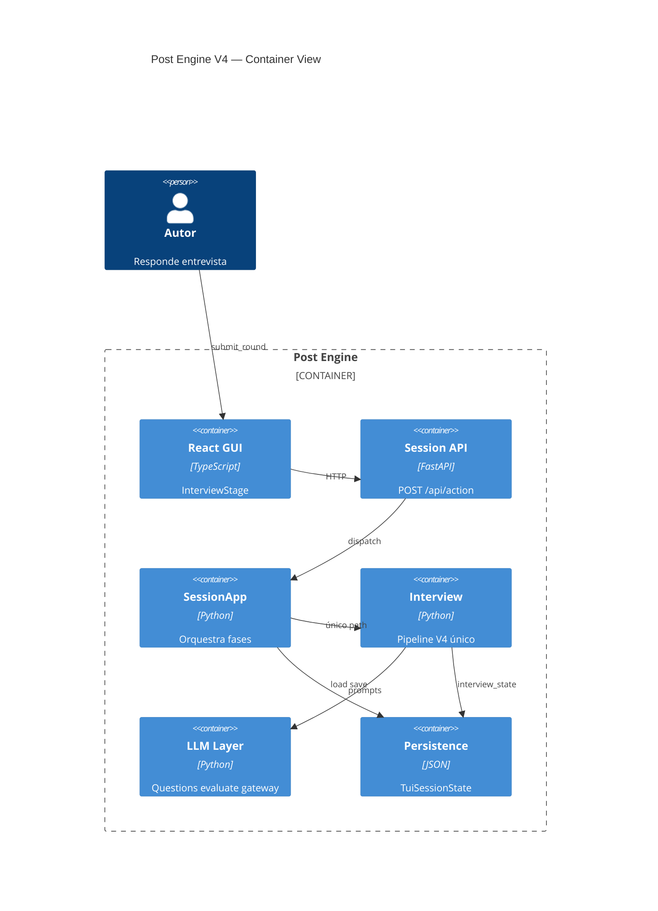
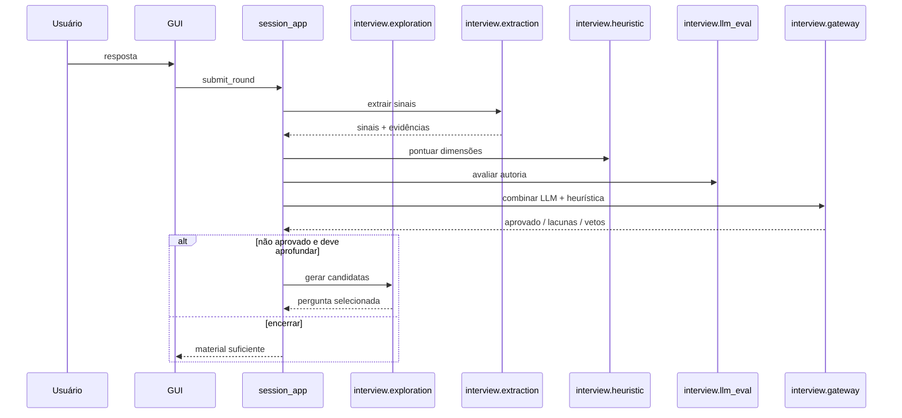

# Implementation Plan: Post Engine V4 — Entrevista

**Branch**: `spec-061-interview-v4` | **Date**: 2026-07-13 | **Spec**: [spec_061.md](spec_061.md)

## Summary

**Goal**: Reconstruir o mecanismo de entrevista para explorar o tema antes de classificar, preservar fala humana, extrair sinais rastreáveis e aprovar material via gateway híbrido LLM + heurística.

**Approach**: Substituir integralmente o pipeline de entrevista por contratos V4 em `src/content_engine/interview/`, removendo código e campos legados (`legacy`/`batch`/`adaptive`, `interview_mode`, `memory_pack`, 27 eixos obrigatórios). Infraestrutura compartilhada (LLM, persistência, GUI, geração) permanece.

**Key Constraint**: **100% breaking change** — sem modo legado, sem migrador, sem leitura de sessões V2/V3. `SESSION_SCHEMA_VERSION = "4.0"`; sessão com schema anterior é rejeitada ou descartada.

## Technical Context

**Language/Version**: Python 3.11+ (backend), TypeScript/React (frontend)

**Primary Dependencies**: FastAPI (`src/gui/server.py`), Pydantic/dataclasses (`schemas.py`), pytest, Vitest (frontend), AgentWrapper/Codex/OpenCode (`llm_config.py`)

**Storage**: JSON monolítico em `.data/sessions/current-session.json` via `persistence.py`; estado de entrevista usa apenas contratos V4 (`interview_state`, `evidence_ledger`, `gateway_result`)

**Testing**: pytest (`tests/`), fakes LLM em `tests/llm_fakes.py`; portar casos úteis de `test_adaptive_quality.py` antes de deletar

**Target Platform**: GUI React como front oficial; TUI deprecada

**Project Type**: web (backend Python + frontend SPA)

**Project Mode**: brownfield

**Performance Goals**: Latência de entrevista comparável à V3 adaptive; gateway híbrido com no máximo 1 chamada LLM por rodada após resposta

**Constraints**: Resposta original imutável; pergunta rejeitada nunca exibida; sessões com `schema_version < 4.0` não são carregadas

**Scale/Scope**: 11 épicos, ~15 entidades de domínio, 20 critérios de aceitação, refactor de `session_app.py` (~5k linhas) e camada de entrevista GUI

## Instructions Check

*GATE: Deve passar antes da implementação. Revalidar ao concluir Épico 8.*

| Gate | Status | Evidência |
|------|--------|-----------|
| Fase 0 concluída (research.md completo) | Parcial | `research.md` §7 — 4 entregáveis faltantes |
| Quebra de contrato documentada | OK | `research.md` §9, `spec_061.md` §11 |
| Código legado de entrevista removido | Pendente | Épico 10 — deletar adaptive/legacy/batch |
| Prompts de entrevista versionados em `prompts/interview/` | OK | Convenção existente |
| GUI como único front de entrevista | OK | `TUI_DECREPATED.md` |

## Architecture



### Fluxo V4 por rodada



## Architecture Decisions

| ID | Decision | Options Considered | Chosen | Rationale |
|----|----------|--------------------|--------|-----------|
| AD-001 | Localização do código | Módulo paralelo `v4/` / Substituir in-place | `src/content_engine/interview/` substitui stack antigo | Breaking change; deletar `adaptive_interview.py`, paths legacy em `questions.py`/`interview.py` |
| AD-002 | Versão de schema | Incremental / Hard break 4.0 | `SESSION_SCHEMA_VERSION = "4.0"` | Sessões antigas inválidas; sem migrador |
| AD-003 | Modo de sessão | Coexistir modos / Pipeline único | **Remover `interview_mode`** | Um único fluxo; sem `legacy`/`batch`/`adaptive` |
| AD-004 | Fonte de evidências | `memory_pack` / ledger V4 | `evidence_ledger` V4 apenas | **Deletar** `memory_pack.py` e campo persistido |
| AD-005 | Gateway LLM | Só heurística / Só LLM / Híbrido | Híbrido obrigatório | V3 não usa LLM no gateway; V4 exige ambos (`research.md` §12.2) |
| AD-006 | Prompts de exploração | Inline Python / Markdown versionado | Markdown em `prompts/interview/` (substituir arquivos antigos) | Deletar `initial-*`, `recursive-*`, prompts por eixo |
| AD-007 | Dimensões vs eixos | 27 eixos obrigatórios / Catálogo interpretativo | Dimensões autorais sem obrigatoriedade de cobertura | `spec_061.md` §4, §11 |
| AD-008 | GUI collections | Grupos no radar / Dimensões flat | `COLEÇÃO_CONTABILIZADA = COLEÇÃO_RENDERIZADA` | Bug confirmado (`research.md` §8, `spec_061.md` §12.2) |
| AD-009 | Briefing pós-entrevista | Duplicar humanos+pack / Projeção do ledger V4 | Briefing derivado on-demand do ledger | Elimina 4–5 cópias da mesma resposta (`research.md` §1.11) |
| AD-010 | Sessões antigas | Migrador / Modo legado / Hard reject | **Rejeitar** schema `< 4.0`; sessão fresca | Sem compatibilidade retroativa |

## Data Model Summary

| Entity | Key Fields | Relationships | Notes |
|--------|------------|---------------|-------|
| `InterviewV4Session` | `schema_version`, `progress_state`, `question_count` | 1→N rodadas | Estados: EXPLORANDO…CONCLUÍDA (`spec_061.md` §12.7) |
| `ThemeContext` | `tema`, `objetivo`, `formato`, `personalidade` | 1 por sessão | Sem estrutura editorial |
| `QuestionCandidate` | `text`, `direction`, `risk_scores` | N por geração | Nunca exibida se rejeitada |
| `SelectedQuestion` | `question`, `why_now`, `source` | 1 ativa | Gate de qualidade obrigatório |
| `UserAnswer` | `original`, `normalized` | imutável original | `spec_061.md` §5.3 |
| `Evidence` | `id`, `text`, `source_answer_id` | N por resposta | Trecho literal |
| `AuthorialSignal` | `type`, `summary`, `confidence`, `status`, `evidence_ids` | N por resposta | CONFIRMADO/INFERIDO/… |
| `AuthorialDimension` | `id`, `state`, `score`, `rules_triggered` | catálogo + observações | 8 estados (`spec_061.md` §12.4) |
| `DeterministicAssessment` | `dimensions`, `global_score`, `vetos` | 1 por rodada | Explicável (`FR-007`) |
| `LlmAssessment` | `approved`, `confidence`, `strengths`, `risks` | 1 por rodada | Não suficiente sozinha |
| `GatewayResult` | `approved`, `gateway_type`, `gaps`, `justification` | 1 corrente | EQUILIBRADO/DESEQUILIBRADO_FORTE/REPROVADO |
| `Gap` | `type`, `relevance`, `expected_gain` | N pós-extração | Só após sinais (`spec_061.md` §7) |
| `DeepeningDecision` | `should_ask`, `reason` | 0–1 por rodada | `DEVE_APROFUNDAR` (`spec_061.md` §8) |

**Detail**: entidades em `src/content_engine/interview/schemas.py`; persistência direta em `TuiSessionState` (campos V4 substituem legados).

## API Surface Summary

N/A — sem novos endpoints HTTP. V4 reutiliza contratos existentes:

| Método | Path | Alteração V4 |
|--------|------|--------------|
| GET | `/api/session` | `derived.interview` expõe dimensões/sinais/evidências V4 |
| POST | `/api/action` | `continue_phase1`, `submit_round`, `generate_other_question` usam **apenas** pipeline V4 |

**Detail**: mapeamento em `session_app.py` + `frontend/src/lib/mappers/interview.ts`.

## Testing Strategy

| Tier | Tool | Scope | Mock Boundary | Install |
|------|------|-------|---------------|---------|
| Unit | pytest | `interview/*`, validadores, gateway, extração | LLM via `tests/llm_fakes.py` | configured |
| Integration | pytest | `session_app` actions V4 end-to-end | AgentWrapper fake | configured |
| Regression | pytest + corpus JSON | Métricas de qualidade no corpus (baseline histórico opcional, não runtime V3) | fixtures em `tests/fixtures/interview_corpus/` | new corpus dir |
| Security | ruff/bandit (se configurado) | sem segredos em prompts/logs | — | configured |
| Coverage | pytest-cov | módulos `interview/` ≥ 80% em regras críticas | — | `uv run pytest --cov` |

## Acceptance Test Stubs

| Req ID | Test File | Stub Blocks (framework-native) | RED Status |
|--------|-----------|----------------------------------|------------|
| FR-001 | tests/test_interview_exploration.py | `def test_FR_001_initial_prompt_excludes_editorial_structure()` | failing-assertion |
| FR-002 | tests/test_interview_exploration.py | `def test_FR_002_question_does_not_presuppose_answer()` | failing-assertion |
| FR-003 | tests/test_interview_exploration.py | `def test_FR_003_compound_question_blocked()` | failing-assertion |
| FR-004 | tests/test_interview_exploration.py | `def test_FR_004_rejected_question_never_displayed()` | failing-assertion |
| FR-005 | tests/test_interview_extraction.py | `def test_FR_005_original_answer_immutable()` | failing-assertion |
| FR-006 | tests/test_interview_extraction.py | `def test_FR_006_every_signal_has_evidence()` | failing-assertion |
| FR-007 | tests/test_interview_heuristic.py | `def test_FR_007_deterministic_score_is_explainable()` | failing-assertion |
| FR-008 | tests/test_interview_gateway.py | `def test_FR_008_llm_alone_cannot_approve_gateway()` | failing-assertion |
| FR-009 | tests/test_interview_gateway.py | `def test_FR_009_heuristic_alone_cannot_approve_gateway()` | failing-assertion |
| FR-010 | tests/test_interview_gateway.py | `def test_FR_010_balanced_gateway_requires_essential_dimensions()` | failing-assertion |
| FR-011 | tests/test_interview_gateway.py | `def test_FR_011_strong_imbalanced_gateway_rules()` | failing-assertion |
| FR-012 | tests/test_interview_gateway.py | `def test_FR_012_absolute_vetoes_block_approval()` | failing-assertion |
| FR-013 | tests/test_interview_gateway.py | `def test_FR_013_exceptional_story_compensates_weak_secondary()` | failing-assertion |
| FR-014 | tests/test_interview_gaps.py | `def test_FR_014_optional_gaps_do_not_extend_approved_interview()` | failing-assertion |
| FR-015 | tests/test_interview_session.py | `def test_FR_015_system_explains_question_and_closure()` | failing-assertion |
| FR-016 | tests/test_interview_gui_mapper.py | `def test_FR_016_gui_distinguishes_group_dimension_signal_evidence()` | failing-assertion |
| FR-017 | tests/test_interview_gui_mapper.py | `def test_FR_017_counter_list_chart_same_collection()` | failing-assertion |
| FR-018 | tests/test_interview_gui_mapper.py | `def test_FR_018_chart_does_not_plot_groups_as_axes()` | failing-assertion |
| FR-019 | tests/test_interview_quality.py | `def test_FR_019_low_induced_answer_rate_on_corpus()` | skip |
| FR-020 | tests/test_interview_quality.py | `def test_FR_020_high_original_language_preservation()` | skip |

## Error Handling Strategy

| Error Category | Pattern | Response | Retry |
|----------------|---------|----------|-------|
| LLM timeout/parse | degrade com status explícito | `RuntimeError` → não exibir pergunta; log em `session_log` | até 3 tentativas com feedback negativo |
| Candidata rejeitada | fail-closed | próxima candidata; nunca `forced` ao usuário | substituir FR-004 vs `adaptive_llm_forced` |
| Gateway veto | bloqueio determinístico | continuar entrevista com lacuna crítica | não retry automático |
| Sessão schema antigo | hard reject | `ValueError` + sessão fresca; mensagem clara na GUI | N/A |
| Persistência corrompida | fail-safe existente | sessão fresca (`persistence.py:408`) | N/A |

## Integration Points

| Spec Reference | System/Service | Technical Approach | Contract |
|----------------|----------------|--------------------|----------|
| §5.1 Exploração | OpenCode/Qwen (`llm_config`) | `prompts/interview/explore.md` | JSON candidatas |
| §6.4 Avaliação LLM | Cursor/Codex | `prompts/interview/evaluate-authorship.md` | `LlmAssessment` |
| §12 GUI | React InterviewStage | mapper `interview.ts` reescrito | `InterviewUi` |
| §11 Quebra | `persistence.py` | validar `schema_version == "4.0"` | rejeitar anterior |
| Downstream geração | `prompt_builder.py` | briefing derivado do `evidence_ledger` | `GenerationPromptInput` |

## Risk Mitigation

| Risk (from spec/research) | Likelihood | Impact | Mitigation | Owner |
|---------------------------|------------|--------|------------|-------|
| `session_app.py` monolítico | H | H | Orquestração em `interview/controller.py` | interview/controller |
| Perguntas rejeitadas exibidas | H | H | Gate único `select_question()`; proibir forced display | interview/exploration |
| Corpus incompleto (8/12 categorias) | M | H | Épico 0 T003 antes de FR-019/020 | tests/fixtures |
| Duplicação briefing | M | M | AD-009; projeção on-demand do ledger | interview/briefing |
| Gateway LLM custo/latência | M | M | 1 chamada por rodada; cache de avaliação | interview/gateway |
| Resíduos de código legado | M | H | Épico 10 deleta módulos e testes V3; grep por `interview_mode`/`memory_pack` | cleanup |
| GUI contador ≠ gráfico | H | M | AD-008; testes mapper FR-017/018 | frontend mapper |

## Requirement Coverage Map

| Req ID | Component(s) | File Path(s) | Function(s)/Symbol(s) | Notes |
|--------|--------------|--------------|------------------------|-------|
| FR-001 | exploration | `prompts/interview/explore.md`, `src/content_engine/interview/exploration.py` | `build_exploration_prompt()`, `generate_candidates()` | Sem `estruturaEsperada` |
| FR-002 | exploration | `src/content_engine/interview/exploration.py`, `src/content_engine/interview/validation.py` | `score_induction_risk()`, `select_question()` | Portar heurísticas úteis; deletar `questions.py` legado |
| FR-003 | validation | `src/content_engine/interview/validation.py` | `validate_question()`, `_COMPOUND_QUESTION_RE` | Sem fallback forced |
| FR-004 | exploration | `src/content_engine/interview/exploration.py`, `src/content_engine/session_app.py` | `select_question()`, `display_question()` | Eliminar `adaptive_llm_forced` |
| FR-005 | extraction | `src/content_engine/interview/extraction.py`, `src/content_engine/interview/schemas.py` | `UserAnswer`, `append_answer()` | Original imutável |
| FR-006 | extraction | `src/content_engine/interview/extraction.py` | `extract_signals()`, `Evidence`, `AuthorialSignal` | `evidence_ids` obrigatório |
| FR-007 | heuristic | `src/content_engine/interview/heuristic.py` | `assess_dimensions()`, `DimensionScore` | `rules_triggered` por dimensão |
| FR-008 | gateway | `src/content_engine/interview/gateway.py` | `evaluate_gateway()` | LLM necessária, não suficiente |
| FR-009 | gateway | `src/content_engine/interview/gateway.py` | `evaluate_gateway()` | Heurística necessária, não suficiente |
| FR-010 | gateway | `src/content_engine/interview/gateway.py` | `_balanced_gateway()` | Todas essenciais ≥ mínimo |
| FR-011 | gateway | `src/content_engine/interview/gateway.py` | `_strong_imbalanced_gateway()` | Excepcionais + piso global |
| FR-012 | gateway | `src/content_engine/interview/heuristic.py` | `detect_absolute_vetos()` | 6 vetos `spec_061.md` §6.6 |
| FR-013 | gateway | `src/content_engine/interview/gateway.py` | `_strong_imbalanced_gateway()` | Compensação por força |
| FR-014 | gaps | `src/content_engine/interview/gaps.py` | `decide_deepening()` | Respeitar gateway aprovado |
| FR-015 | controller | `src/content_engine/interview/controller.py` | `explain_decision()` | `why_now`, justificativa encerramento |
| FR-016 | gui mapper | `frontend/src/lib/mappers/interview.ts` | `mapInterview()` | Reescrita total |
| FR-017 | gui mapper | `frontend/src/lib/mappers/interview.ts`, `frontend/src/lib/pe-types.ts` | `InterviewUi.dimensions` | Mesma coleção |
| FR-018 | gui | `frontend/src/components/workstation/interview/AuthorialMap.tsx` | props `dimensions` | Sem grupos no radar |
| FR-019 | quality | `tests/test_interview_quality.py`, `tests/fixtures/interview_corpus/` | `measure_induced_answer_rate()` | Baseline histórico no corpus, não runtime V3 |
| FR-020 | quality | `tests/test_interview_quality.py` | `measure_original_language_preservation()` | Épico 9 |

### Cobertura por Épico (spec §13)

| Épico | Requisitos | Entregável principal |
|-------|------------|----------------------|
| 0 — Pesquisa | pré-requisito | `research.md` completo + corpus + diagrama |
| 1 — Domínio | FR-005, FR-006 | `interview/schemas.py`, persistência 4.0 |
| 2 — Exploração | FR-001–FR-004 | `interview/exploration.py`, prompts |
| 3 — Extração | FR-005, FR-006 | `interview/extraction.py` |
| 4 — Heurística | FR-007, FR-012 | `interview/heuristic.py` |
| 5 — Avaliação LLM | FR-008 | `interview/llm_evaluation.py` |
| 6 — Gateway híbrido | FR-008–FR-013 | `interview/gateway.py` |
| 7 — Lacunas | FR-014, FR-015 | `interview/gaps.py` |
| 8 — GUI | FR-016–FR-018 | mapper + componentes |
| 9 — Qualidade | FR-019, FR-020 | corpus + métricas |
| 10 — Remoção legado | breaking | deletar código V2/V3 de entrevista |

## Project Structure

### Source Code

```text
src/content_engine/
+ interview/                  # pipeline único (substitui stack antigo)
+   __init__.py
+   schemas.py
+   exploration.py
+   validation.py
+   extraction.py
+   heuristic.py
+   llm_evaluation.py
+   gateway.py
+   gaps.py
+   controller.py
+   briefing.py
~ session_app.py              # remove branches legacy/batch/adaptive
~ schemas.py                  # TuiSessionState só campos V4; schema 4.0
~ persistence.py              # rejeita schema < 4.0
~ gateway.py                  # remove avaliar_gateway legado (5 aspectos)
~ briefing.py                 # reescrever para ledger V4
~ prompt_builder.py           # consumir briefing V4
- adaptive_interview.py       # DELETAR
- memory_pack.py              # DELETAR
- interview.py                # DELETAR (executor legacy)
~ questions.py                # DELETAR ou reduzir a re-exports temporários
~ taxonomy.py                 # remover obrigatoriedade de eixos; manter tags opcionais
~ scoring.py                  # DELETAR (5-aspect scoring)
~ evaluator_client.py         # DELETAR (avaliação legacy LLM)

prompts/interview/
+ explore.md                  # substitui initial/recursive/questions-*
+ evaluate-authorship.md
+ deepen.md
- initial-*.md                # DELETAR
- recursive-*.md              # DELETAR
- questions-*.md              # DELETAR
- evaluate-answer.md          # DELETAR
- update-memory-pack.md       # DELETAR

frontend/src/
~ lib/mappers/interview.ts    # reescrita total
~ lib/pe-types.ts
~ components/workstation/interview/*

tests/
+ test_interview_exploration.py
+ test_interview_extraction.py
+ test_interview_heuristic.py
+ test_interview_gateway.py
+ test_interview_gaps.py
+ test_interview_session.py
+ test_interview_gui_mapper.py
+ test_interview_quality.py
+ fixtures/interview_corpus/
- test_adaptive_*.py          # DELETAR após portar casos úteis
- test_spec_001..060 legado   # revisar/remover testes de contratos mortos
~ llm_fakes.py
```

### Brownfield Notes

**Patterns to reuse**: `llm_json_parser`, `AgentWrapper`, `SessionController`, infra de geração/segmentação/exportação (fora da entrevista).

**Portar antes de deletar**: validadores de pergunta (`test_adaptive_quality.py`), rastreio `source_answer_id`, limite honesto (`limite_declarado`).

**Naming conventions**: `snake_case` Python; sem aliases legados em `from_dict` — contrato V4 único.

**Deletar sem substituto**: `interview_mode`, `InterviewPlan`, `InterviewNeed`, `MemoryPack`, `ScoresAutorais`, `AvaliacaoAutoralDaResposta`, `InterviewPack` com cobertura de eixos, `required_axes`.

## Implementation Hints

- **[HINT-001]** Ordem: domínio → extração → heurística → gateway → exploração → lacunas → GUI. Exploração depende de lacunas/gateway para aprofundamento, mas geração inicial pode ser paralela após domínio.

- **[HINT-002]** Gate de exibição: único chokepoint `select_question()` — nenhum fallback forced.

- **[HINT-003]** Não usar `expected_evidence`/`need_id` nos prompts — substituir por `directions_explored` e `signals_summary`.

- **[HINT-004]** `session_app.py`: remover branches adaptive/batch/legacy na mesma entrega que liga `interview/controller.py`.

- **[HINT-005]** Ao subir schema 4.0, documentar no changelog que sessões `.data/sessions/*.json` antigas devem ser arquivadas manualmente — o app não as abre.

- **[HINT-006]** Não manter `interview_v4` como namespace nested; campos V4 são os campos da sessão.
