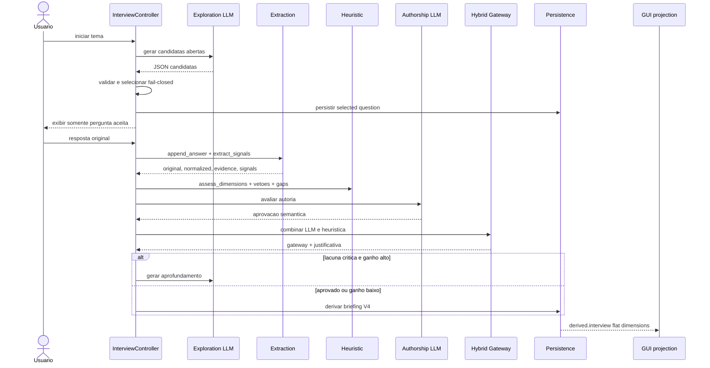

# Research — Post Engine V4 (spec-061)

> Fase 0 — Pesquisa e engenharia reversa. Documento vivo, indexado por `file_path:line_number`.
> Objetivo: compreender o comportamento real da ferramenta V3 antes de qualquer implementação V4.

---

## 0. Trajetória do produto (contexto histórico)

| Versão | Marco | Documento de origem | Estado |
|---|---|---|---|
| V2 | 5 aspectos autorais (`experiencia`, `opiniao`, `sentimento`, `aprendizado`, `personalidade`); gateways equilibrado/desequilibrado; `BriefingAutoral` consumido por `PromptBuilder` | `PRD.md` | Implementado |
| fase2 | Taxonomia de **27 eixos** em 7 batches; `InterviewPack`; validação estrita sem fallback silencioso | `fase2evo.md`, `fase2evo_change_log.md` | Implementado (batch mode) |
| adaptive | Núcleo autoral obrigatório (5 needs); gates de qualidade de pergunta/resposta; `evidence_ledger`; `interview_plan`/`InterviewNeed`/`InterviewSufficiency` | `PROPOSTA_EVOLUCAO_ENTREVISTA_ADAPTATIVA.md` | Implementado (PRs 2-4 concluídos; PR 5 composição não) |
| V3 | Storyboard → Rascunhador de Blocos → Composição Editorial entre Briefing e geração; `editorial_flow`; 10 personas editoriais; GUI/React como front oficial (TUI deprecada) | `V3_EVO.md`, `TUI_DECREPATED.md` | Implementado |
| V4 | Quebra de contrato: sinais/evidências/dimensões; gateway híbrido LLM+heurística; exploração antes da classificação | `specs/spec-061/spec.md` | Spec criada; Fase 0 = este documento |

Essência do produto (`PRD.md`): *"Extrair conteúdo humano, autoral e utilizável antes de qualquer organização editorial."* A regra de honestidade narrativa (`PRD.md` seção 36) estabelece que ausência de experiência não vira falsa vivência — base direta dos vetos absolutos do gateway V4 (`spec.md:542-562`).

Especificações existentes (SPEC-001 a SPEC-060): 60 specs cobrindo modelos de domínio, scoring, gateway, prompts de entrevista, personas, geração, segmentação, avaliação de post, exportação, persistência, TUI (deprecada), infraestrutura e testes. Títulos consolidados em `specs/global.md` e `specs/checklist.md`. A numeração `061` foi reutilizada: os testes da spec-061 anterior (modelo dedicado de perguntas e parser do fluxo removido) foram eliminados e substituídos pela cobertura V4 em `tests/test_interview_*.py` e `tests/test_generation_v4_prompt.py`.

---

## 1. Inventário funcional (spec §3.1)

A entrevista opera em **três modos coexistentes** selecionados por `TuiSessionState.interview_mode` (`persistence.py:289-292`):

| Modo | Driver | Unidade de pergunta | Encerramento |
|---|---|---|---|
| `legacy` | `interview.executar_entrevista` (async) + `session_app` legado | 5 aspectos por rodada | `gateway.avaliar_gateway` aprova scores |
| `batch` | `interview.executar_entrevista_por_lotes` + `session_app` batch | Uma pergunta por eixo, agrupada por batch | `interview_pack_completo(pack)` (cobertura binária) |
| `adaptive` | `session_app._gerar_pergunta_adaptativa` + `adaptive_interview` | Uma pergunta por necessidade, por prioridade de lacuna | `evaluate_sufficiency` retorna `rico`/`saturado` |

Os três convergem no downstream para o mesmo `InterviewPack` (`schemas.py:1053`) consumido por `prompt_builder.build_generation_prompt` (`prompt_builder.py:315`).

### 1.1 Início da entrevista

- **Entrada:** `tema`, `plataforma`, `objetivo_do_post`, `tipo_de_post`, `personalidade` (form da GUI).
- **Saída:** `InicioEntrevista` (`schemas.py:117`) persistido em `TuiSessionState.inicio_entrevista`; `interview_plan` via `taxonomy.interview_plan_for_format(tipo)` (`taxonomy.py:684-712`); `interview_sufficiency` inicial `{"status":"coletando",...}`.
- **Estado alterado:** `inicio_entrevista`, `interview_plan`, `interview_sufficiency`, `interview_mode`, `current_stage`.
- **Prompt:** nenhum (início é determinístico).
- **Modelo:** nenhum.
- **Componente:** `session_app.action_start_interview` (`session_app.py:4160`); `_ensure_adaptive_interview_contracts` (`session_app.py:1263`).
- **Consumidores:** gerador de perguntas, avaliador, gateway, briefing.
- **Erro:** `TuiValidationError` se tema vazio ou `tipo_de_post` inválido (`tui_validation.py:52-104`); `ValueError` em `criar_estado_inicial`/`criar_batch_state` (`interview_state.py:160, 188`).

### 1.2 Geração de perguntas

- **Entrada:** `tema`, `objetivo_do_post`, `tipo_de_post`, `interview_plan` (needs + status + prioridade), `entrevista_historico` (perguntas/respostas anteriores), `trait_assessments`, sinais extraídos.
- **Saída:** `QuestionBrief` (`schemas.py:322-362`) com `need_id`, `intent`, `expected_evidence`, `why_now`, `question`, `fallback_strategy`, `repetition_risk`, `source`.
- **Estado alterado:** `lote_atual` (pergunta corrente para exibição); `entrevista_historico` (após resposta).
- **Prompt:** adaptive usa prompt **inline** construído em `questions._build_adaptive_candidates_prompt` (`questions.py:1099`) — **não** é um arquivo Markdown. Batch usa `_BATCH_PROMPT_TEMPLATE` inline (`questions.py:1625`). Legacy usa `interview.initial_{tipo}` e `interview.recursive_{tipo}` (`prompt_loader.py:12-59`).
- **Modelo:** `questions` → default `opencode`/`qwen-3.6-plus` (`llm_config.py:78-81`); `TuiSessionState.question_model` default `gpt-5.4-mini` (`schemas.py:45`); obsoleto `gpt-5.4 mini` (espaço) migrado em `persistence.py:25`.
- **Componente:** `QuestionGenerator.gerar_proxima_pergunta` (`questions.py:1275-1355`, adaptive); `gerar_iniciais` (`:1357`), `gerar_recursivas` (`:1483`), `gerar_lote` (`:1514`); chokepoint `_invoke` (`:1251`) → `AgentWrapper.run`.
- **Consumidores:** exibição na GUI, avaliador de resposta, gateway.
- **Erro:** `_invoke` raises `RuntimeError` em returncode≠0 (`questions.py:1251-1273`); após 3 tentativas sem candidatas válidas → `RuntimeError`; com ≥1 candidata retorna a melhor forçada com `source="adaptive_llm_forced"` (**pergunta rejeitada pode ser exibida** — `questions.py:1355`).

### 1.3 Seleção de perguntas

- **Entrada:** `interview_plan.needs` com `status` e `priority`.
- **Saída:** `need_id` escolhido → `QuestionBrief`.
- **Estado alterado:** nenhum (seleção é funcional).
- **Prompt:** nenhum.
- **Modelo:** nenhum.
- **Componente:** `adaptive_interview.select_next_need` (`adaptive_interview.py:95`) — filtra needs `ausente`/`mencionada`, ordena por `(reparo?, prioridade, -índice)`. Batch: ordem fixa em `BATCH_ORDER` (`taxonomy.py:398-406`). Legacy: aspectos fixos em `ASPECTOS_AUTORAIS`; recursivas pegam `aspectos_mais_fracos` do gateway.
- **Consumidores:** gerador de perguntas.
- **Erro:** nenhum (puro).

### 1.4 Validação das perguntas

- **Entrada:** `QuestionBrief` + histórico recente.
- **Saída:** `QuestionQuality` (`schemas.py:365-408`) com 5 flags booleanos (`singular_intent`, `grounded`, `novel`, `answerable`, `no_editorial_delegation`) + `issues`; `QuestionCandidateEvaluation` (`schemas.py:411-434`) adiciona `need_alignment`, `context_use`, `tone_alignment`, `semantic_score`, `semantic_accepted`.
- **Estado alterado:** nenhum (anexado como metadado ao histórico).
- **Prompt:** nenhum (heurística determinística).
- **Modelo:** nenhum.
- **Componente:** `validar_qualidade_da_pergunta` (`questions.py:584-674`); `avaliar_candidata_pergunta` (`:677-725`); `batch_validation.validate_question_batch` (`:32-133`, batch estrutural).
- **Consumidores:** loop de geração (decide aceitar/rejeitar candidata); **não gating de exibição no modo batch** — `session_app.py:1615` anexa `question_quality` como metadado mas a pergunta é exibida independente do `accepted` (`session_app.py:1630`).
- **Erro:** `BatchValidationError` em batch (`batch_validation.py:23`); `QuestionGenerationError` retornado (não raises) por `parse_and_validate_batch` (`batch_validation.py:136`).

### 1.5 Armazenamento das respostas

- **Entrada:** `resposta` (texto livre do usuário), `question_brief`, `question_quality`, `answer_assessment`.
- **Saída:** entrada em `entrevista_historico` com `rodada`, `modo`, `need_id`, `pergunta`, `resposta`, `question_brief`, `question_quality`, `answer_assessment`; `InterviewAnswer` (`schemas.py:1000-1014`) em batch.
- **Estado alterado:** `entrevista_historico`, `answer_assessments`, `rodada_entrevista`.
- **Prompt:** nenhum.
- **Modelo:** nenhum.
- **Componente:** `session_app._submeter_resposta_adaptativa` (`session_app.py:1477`); batch em `:4353-4444`; legacy em `:4447-4537`.
- **Consumidores:** avaliador, extração de evidências, gateway, briefing.
- **Erro:** nenhum (append puro).

### 1.6 Avaliação das respostas

- **Entrada:** `tema`, `pergunta`, `resposta`, scores atuais (legacy), `memory_pack`.
- **Saída:** adaptive/batch → `AnswerAssessment` (`schemas.py:437-502`) com `relevance`, `specificity`, `authorship`, `editorial_leverage`, `novelty` (0-2 cada), `epistemic_integrity`, `status` ∈ {aceita, reparo, limite_declarado, nao_aproveitavel}, `needs_met`, `evidence_ids`, `remaining_gap`, `repair_suggestion`. Legacy → `AvaliacaoAutoralDaResposta` (`schemas.py:581-590`) com `deltas`, `evidencias`, `lacunas`, `proxima_melhor_pergunta`.
- **Estado alterado:** nenhum (resultado imutável; chamador persiste).
- **Prompt:** legacy usa `interview.evaluate_answer` (`prompt_builder.build_evaluation_prompt`, `prompt_builder.py:372-393`); adaptive/batch usam **heurística local** sem LLM — docstring admite "Esta heurística não substitui uma futura avaliação semântica mais rica por LLM" (`questions.py:738-741`).
- **Modelo:** legacy `answer_evaluate` → `cursor`/`auto` (`llm_config.py:82-85`); adaptive/batch nenhum.
- **Componente:** `questions.avaliar_resposta` (`questions.py:728-806`, local); `evaluator_client.AuthorialEvaluationClient.avaliar` (`evaluator_client.py:172-235`, LLM legacy).
- **Consumidores:** atualização de estado autoral, extração de evidências, gateway, decisão de reparo.
- **Erro:** legacy: erro de agente → `AvaliacaoAutoralDaResposta(status="erro_avaliacao", source="agent_error")` com deltas zerados (degradação silenciosa, `evaluator_client.py:216-221`); parse error → `source="parse_error"` (`:223-229`). adaptive: puro, sem erro. `_calibrar_deltas` (`evaluator_client.py:108-121`) zera deltas sem evidência (única ponte determinística entre score e evidência).

### 1.7 Extração de evidências

- **Entrada:** `resposta`, `AnswerAssessment`, `inferir_tracos_autoriais`.
- **Saída:** `EvidenceItem` (`schemas.py:267-319`) com `id` (`ev:{answer_id}`), `text`, `origin` ∈ {autor, legacy_import, editorial_synthesis}, `types`, `legacy_axes`, `quality`, `source_answer_id`, `editorial_uses`. Legacy: `evidencias: ListaAspectos` (dict aspecto→list[str]).
- **Estado alterado:** `evidence_ledger: list[dict]` (`schemas.py:905`); `trait_assessments` (upgrade monotônico de nível).
- **Prompt:** legacy via `interview.evaluate_answer`; adaptive via `questions.update_memory_pack` (`PROMPT_PATHS` registrado mas extração efetiva é local).
- **Modelo:** nenhum em adaptive (extração local via `inferir_tracos_autoriais`, `questions.py:818-917`).
- **Componente:** `questions.criar_evidencia_local` (`questions.py:920-949`) — apenas se `status ∈ {aceita, limite_declarado}`; `session_app._registrar_evidencia_adaptativa` (`session_app.py:1280`); legacy `atualizar_memory_pack` (`memory_pack.py:64-112`).
- **Consumidores:** `trait_assessments.evidence_ids`, gateway, briefing, geração.
- **Erro:** nenhum (cria evidência apenas se aprovada).

### 1.8 Atualização do estado autoral

- **Entrada:** `AnswerAssessment`, `InterviewPlan`.
- **Saída:** novo `InterviewPlan` (frozen, via `dataclasses.replace`); `trait_assessments` atualizado.
- **Estado alterado:** `interview_plan` (needs status/evidence_ids/repair_count); `trait_assessments`.
- **Prompt:** nenhum.
- **Modelo:** nenhum.
- **Componente:** `adaptive_interview.apply_assessment` (`adaptive_interview.py:152`); `inferir_tracos_autoriais` (`questions.py:818-917`); `scoring.atualizar_scores` (`scoring.py:60-83`, legacy).
- **Consumidores:** gateway, seleção da próxima pergunta.
- **Erro:** retorna `(plan, None, False)` se `need_id` não encontrado (sem raise).

Máquina de estados do need: `ausente` → `mencionada` → (`aceita` | `limite_declarado`) ou → (reparo #1) `mencionada`+`repair_count=1` → (reparo #2) `saturada`.

### 1.9 Gateway

- **Entrada:** `InterviewPlan` (adaptive) ou `InterviewPack.coverage` (batch) ou `ScoresAutorais` (legacy).
- **Saída:** adaptive → `InterviewSufficiency` (`schemas.py:538-578`) com `status` ∈ {coletando, reparo, elegivel, rico, saturado, encerrado}, `human_gate`, `format_gate`, `critical_gaps`, `question_count`. Legacy → `ResultadoGateway` (`schemas.py:619-625`) com `aprovado`, `tipo_gateway` ∈ {equilibrado, desequilibrado, reprovado}, `tipo_autoria`, `restricoes_de_geracao`, `proximas_lacunas`.
- **Estado alterado:** `interview_sufficiency`; `gateway`; `restricoes_de_geracao`.
- **Prompt:** nenhum.
- **Modelo:** **nenhum — gateway é 100% determinístico em todos os modos.** A LLM não aprova o gateway isoladamente em nenhuma versão atual.
- **Componente:** `adaptive_interview.evaluate_sufficiency` (`adaptive_interview.py:239`); `gateway.avaliar_gateway_interview_pack` (`gateway.py:564-573`, batch — **cobertura pura, sem gate de qualidade**); `gateway.avaliar_gateway` (`gateway.py:576-613`, legacy — equilibrado/desequilibrado).
- **Consumidores:** encerramento, briefing, geração (restricoes).
- **Erro:** puro, sem I/O.

Thresholds por formato em `GATEWAY_PROFILES` (`gateway.py:38-68`): article mais estrito (min_total_bruto=800), short_carousel mais frouxo (500). `min_rodadas_para_aprovacao=2` universal.

### 1.10 Encerramento

- **Entrada:** `InterviewSufficiency` ou `ResultadoGateway`.
- **Saída:** `BriefingAutoral` (legacy dataclass, `schemas.py:678-688`) ou dict briefing (`briefing.montar_briefing_do_interview_pack`, `briefing.py:169-202`); `interview_pack` final.
- **Estado alterado:** `briefing_autoral`; `interview_pack`; `current_stage` → `briefing`; `gateway` forçado `aprovado=True, tipo_gateway="equilibrado", tipo_autoria="hibrida"` em adaptive (`session_app.py:1436`).
- **Prompt:** nenhum.
- **Modelo:** nenhum.
- **Componente:** `session_app._finalizar_entrevista_adaptativa` (`session_app.py:1436`); `_finalizar_entrevista_batch` (`:1735`); `briefing.montar_briefing_autoral` (`briefing.py:76`).
- **Consumidores:** geração, segmentação, exportação.
- **Erro:** `BriefingNaoAprovado` (`briefing.py:27`) se gateway não aprovado em legacy; `ValueError` se `interview_pack_completo` falso em batch (`session_app.py:1735`).

### 1.11 Briefing

- **Entrada:** `InterviewPack` ou `EstadoEntrevista`.
- **Saída:** dict briefing com `schema_version`, `theme`, `platform`, `objective`, `content_type`, `personality`, `interview_profile`, `coverage`, `required_axes`, `batches`, `humanos`, `organizacionais`, `flat_answers`, `memory_pack`, `interview_pack` (`briefing.py:186-201`).
- **Estado alterado:** `briefing_autoral`.
- **Duplicação crítica:** `humanos` + `organizacionais` + `flat_answers` + `memory_pack` + `interview_pack` embutido = **a mesma resposta aparece 4-5 vezes** sob shapes diferentes no briefing (`briefing.py:197-201`).
- **Componente:** `briefing.montar_briefing_do_interview_pack` (`briefing.py:169`).
- **Consumidores:** `prompt_builder.build_generation_prompt` (`prompt_builder.py:326-328`).

### 1.12 Geração

- **Entrada:** `GenerationPromptInput` (`schemas.py:817-829`) — `tema`, `plataforma`, `objetivo_do_post`, `tipo_de_post`, `briefing_autoral`, `interview_pack`, `scores`, `restricoes_de_geracao`, `personalidade`, `tipo_gateway`, `tipo_autoria`.
- **Saída:** `ConteudoGerado` (`generator.py:340`) — `conteudo`, `metadados`, `alertas`, `agent_result`, `parse_error`, `slides`, `slidemark`, `sugestoes_imagem`.
- **Estado alterado:** `conteudo_gerado`, `conteudo_json`, `segmentos=[]`, `avaliacao_post={}`.
- **Prompt:** `generator.base` / `generator.base_short_carousel` / `generator.base_long_slide` + persona + rules + `ANTI_IA_POLICIES` (20 políticas, `prompt_builder.py:47-288`).
- **Modelo:** `content_generate` → `codex`/`gpt-5.5`/`xhigh`/`read-only` (`llm_config.py:86-91`).
- **Componente:** `generator.ContentGenerator.generate` (`generator.py:442`).
- **Consumidores:** segmentação, avaliação de post, exportação.
- **Erro:** **não raises** — retorna `ConteudoGerado` com `parse_error`+`alertas` em falha de agente/JSON (`generator.py:455, 464`).

### 1.13 Exportação

- **Entrada:** `conteudo`, `metadados`, `alertas`, `slides`, `segmentos`, `avaliacao_post`, `slidemark`, `tema`, `plataforma`, `tipo_de_post`.
- **Saída:** arquivos `.md` + `.json` (ou `.slidemark.json` para trilhas visuais) em `exports/`.
- **Estado alterado:** nenhum (apenas filesystem).
- **Prompt:** nenhum.
- **Modelo:** nenhum.
- **Componente:** `exporter.exportar_conteudo` (`exporter.py:127`).
- **Consumidores:** usuário final.
- **Erro:** sem try/except; erros de filesystem propagam.

### 1.14 Retomada de sessões

- **Entrada:** `.data/sessions/current-session.json`.
- **Saída:** `TuiSessionState` reconstruído.
- **Estado alterado:** todo o estado da sessão.
- **Componente:** `persistence.carregar_sessao` (`persistence.py:401`); `carregar_sessao_de_payload` → `_dict_to_state` (`:276`); `session_app._ensure_phase2_ready` (`:1777`).
- **Migrações:** `_phase_from_payload` (`:205`), `_stage_from_payload` (`:155`), `_question_model_from_payload` (`:185`), `_migrar_lote_atual` (`:246`), `migrate_tipo_de_post` (`schemas.py:85`), `interview_mode` default `"legacy"` (`:290`), `normalize_editorial_flow` (`:385`).
- **Erro:** `carregar_sessao` engole `OSError`/`ValueError`/`JSONDecodeError` e retorna `TuiSessionState()` fresco (`persistence.py:408, 414`) — **fail-safe mas com perda silenciosa em corrupção**.

---

## 2. Inventário de contratos (spec §3.2)

### 2.1 Contratos persistidos em `TuiSessionState` (`schemas.py:847-911`)

| Campo | Schema | Linha | Classificação |
|---|---|---|---|
| `inicio_entrevista` | `InicioEntrevista` | `:853` | ESSENCIAL |
| `estado_entrevista` | `EstadoEntrevista` | `:854` | LEGADO (5-aspect) |
| `scores` | `ScoresAutorais` | `:868` | LEGADO (5-aspect) |
| `gateway` | `ResultadoGateway` | `:870` | ESSENCIAL |
| `memory_pack` | `MemoryPack` | `:871` | DUPLICADO (ver §2.4) |
| `pergunta_atual`/`resposta_atual` | str | `:872-873` | LEGADO (single-question) |
| `lote_atual` | list[dict] | `:875` | LEGADO (batch) |
| `entrevista_historico` | list[dict] | `:876` | ESSENCIAL |
| `proximas_perguntas` | list[dict] | `:877` | LEGADO |
| `fase_atual` | str | `:878` | DUPLICADO de `current_stage` |
| `current_phase` | str | `:851` | LEGADO (phase names) |
| `current_stage` | str | `:852` | ESSENCIAL |
| `briefing_autoral` | dict | `:867` | ESSENCIAL (adaptive dict) |
| `restricoes_de_geracao` | list[str] | `:869` | EDITORIAL |
| `interview_mode` | str | `:897` | ESSENCIAL |
| `batch_interview_state` | dict | `:898` | LEGADO (batch) |
| `interview_pack` | dict | `:899` | ESSENCIAL (batch) |
| `interview_schema_version` | str | `:903` | ESSENCIAL |
| `interview_plan` | dict | `:904` | ESSENCIAL (adaptive) |
| `evidence_ledger` | list[dict] | `:905` | ESSENCIAL |
| `answer_assessments` | list[dict] | `:906` | ESSENCIAL |
| `trait_assessments` | dict | `:907` | LEGADO (usa `AspectoAutoral` 5-enum) |
| `interview_sufficiency` | dict | `:908` | ESSENCIAL |
| `editorial_flow` | dict | `:911` | ESSENCIAL (V3) |
| `conteudo_gerado`/`conteudo_json` | — | `:887-888` | ESSENCIAL |
| `segmentos` | list | `:889` | ESSENCIAL |
| `avaliacao_post` | dict | `:890` | EDITORIAL |
| `tool`/`model`/`question_model`/`sandbox` | — | `:862-865` | ESSENCIAL |

### 2.2 Schemas centrais (definidos em `schemas.py`)

| Schema | Linha | Classificação de campos | Notas |
|---|---|---|---|
| `question_brief` (`QuestionBrief`) | `:322-362` | `need_id`, `intent`, `expected_evidence`, `why_now`, `question` ESSENCIAL; `fallback_strategy`, `repetition_risk` EDITORIAL; `source` DERIVADO | `from_dict` aceita keys em português legados |
| `question_quality` (`QuestionQuality`) | `:365-408` | 5 flags ESSENCIAL; `issues` DERIVADO; `accepted` DERIVADO (property) | Gate determinístico |
| `answer_assessment` (`AnswerAssessment`) | `:437-502` | `relevance`, `specificity`, `authorship`, `novelty`, `status`, `needs_met`, `evidence_ids`, `epistemic_integrity` ESSENCIAL; `editorial_leverage` EDITORIAL; `remaining_gap`, `repair_suggestion` EDITORIAL | `from_dict` aceita keys em português |
| `evidence_ledger` (`EvidenceItem`) | `:267-319` | `id`, `text`, `origin`, `types`, `source_answer_id` ESSENCIAL; `legacy_axes` LEGADO; `quality` DERIVADO; `editorial_uses` EDITORIAL | Rastreável via `source_answer_id` |
| `interview_plan` (`InterviewPlan`/`InterviewNeed`) | `:179-264` | `id`, `label`, `required`, `status`, `evidence_ids` ESSENCIAL; `priority`, `minimum/target/maximum_questions` EDITORIAL; `human_gate` ESSENCIAL; `repair_count` DERIVADO | Núcleo adaptive |
| `gateway` (`ResultadoGateway`) | `:619-625` | `aprovado`, `tipo_gateway`, `tipo_autoria` ESSENCIAL; `restricoes_de_geracao` EDITORIAL; `proximas_lacunas` DERIVADO | `GatewayAprovado` (`:656`) é DUPLICADO |
| `memory_pack` (`MemoryPack`) | `:593-616` | 9 campos AUTORAL/EDITORIAL mas **DUPLICADO** do `evidence_ledger` (5 campos sobrepõem); **sem `from_dict`** (INCONSISTENTE); `pontos_ainda_fracos` SEM CONSUMIDOR no path adaptive; `exemplos_concretos` é cópia de `fatos_vividos` (`briefing.py:137`) | Candidato a remoção na V4 |
| `briefing autoral` | `:678-688` (legacy dataclass) vs `briefing.py:169-202` (dict adaptive) | DUPLICADO/INCONSISTENTE — duas formas coexistem | V4 deve escolher uma |
| `AvaliacaoAutoralDaResposta` | `:581-590` | LEGADO — `deltas`/`evidencias`/`lacunas` duplicados por `AnswerAssessment` | Remover na V4 |
| `InterviewPack` | `:1052-1144` | `answers[kind][group][axis]`, `coverage`, `personality` ESSENCIAL; `schema_version="2.0"` | Contrato batch |
| `InterviewCoverage` | `:1017-1049` | `by_axis`, `by_group`, `total_axes`, `covered_axes` ESSENCIAL; `percent` property DERIVADO | **`percent` = o "percentual de preenchimento"** |
| `ScoreDoPost` | `:707-749` | 9 dimensões EDITORIAL; `total` weighted avg com cap (tese≥8 e progressao<5 → ≤7) | Avaliação pós-geração |

### 2.3 `required_axes` / "27 eixos"

- **27 eixos confirmados** em `ALL_AXIS_DEFINITIONS` (`taxonomy.py:346-374`) via `grep -c "^    AXIS_" taxonomy.py` = 27.
- 17 humanos (4 grupos: interno/cognitivo/biografico/relacional) + 10 organizacionais (3 grupos: argumento/arquitetura/formato).
- `axes_required_for_format(tipo)` (`taxonomy.py:775-786`) retorna eixos obrigatórios por formato.
- `required_axes` embutido no briefing dict (`briefing.py:195`).
- **Grupos NÃO são eixos** na taxonomia (`kind → group → axis`), mas a GUI os trata como eixos no gráfico (ver §6).

### 2.4 Duplicação `memory_pack` ↔ `evidence_ledger`

`MemoryPack` (`schemas.py:593-616`) sobrepõe 5 campos com `EvidenceItem.types`:
- `fatos_vividos` ≈ tipo "experiencia"
- `opinioes` ≈ "opiniao"
- `sentimentos` ≈ "sentimento"
- `aprendizados` ≈ "aprendizado"
- `tracos_de_personalidade` ≈ "personalidade"

Campos exclusivos do MemoryPack: `exemplos_concretos` (cópia de `fatos_vividos`, `briefing.py:137`), `frases_do_usuario` (≈ `EvidenceItem.text`), `tensoes_ou_conflitos`, `pontos_ainda_fracos` (flattened de `avaliacao.lacunas`, perde estrutura por aspecto).

**Veredito V4:** `memory_pack` é uma projeção desnormalizada e perde-estrutura do `evidence_ledger`. A spec (`spec.md:712`) explicitamente lista `memory_pack` como conceito a não persistir na V4.

### 2.5 Contratos HTTP (frontend ↔ backend)

Definidos em `src/gui/server.py:843-938`, consumidos por `frontend/src/lib/pe-api.ts`:

| Método | Path | Propósito |
|---|---|---|
| GET | `/api/session` | Snapshot completo `{state, derived, options}` |
| PATCH | `/api/session` | Salvar campos editáveis (filtrado por `EDITABLE_FIELDS`, `server.py:107-123`) |
| POST | `/api/action` | Executar ação nomeada (`{action, state, ...params}`) |
| POST | `/api/restore` | Restaurar sessão de JSON |
| GET/PUT | `/api/llm-config` | Config de operações LLM |

25+ ações dispatch em `server.py:377-460`: `continue_phase1`, `submit_round`, `generate_other_question`, `continue_phase2`, `render_prompt`, `run`, `segment`, `rewrite_segment`, `apply_segment`, `rewrite_segments_bulk`, `apply_segments_bulk`, `evaluate`, `export`, `export_slidemark`, `navigate`, `generate_storyboard`, `update_storyboard`, `generate_block_drafts`, `retry_block_draft`, `select_block_draft`, `compose_editorial`.

### 2.6 Tipos do frontend (`frontend/src/lib/pe-types.ts`)

- `StageId` (`:1-13`) — 12 estágios; `prompt`/`execution` definidos mas **inalcançáveis** no rail.
- `Dimension` (`:44-51`) — union de 7 labels de grupo, **declarado mas nunca validado** (cast cego em `interview.ts:69`).
- `AxisCoverage` (`:36-42`) — `{key, label, dimension, covered, total}`.
- `InterviewUi` (inline em `mappers/interview.ts:3-58`) — contém `groups`, `chart_series`, `coverage_tips`, `coverage`, `batches`.

### 2.7 Versionamento — 5 strings independentes (INCONSISTENTE)

| String | Valor | Onde |
|---|---|---|
| `INTERVIEW_SCHEMA_VERSION` | `"3.0"` | `schemas.py:46` (interview_plan) |
| `InterviewPack.schema_version` | `"2.0"` | `schemas.py:1067` (pack) |
| `SESSION_SCHEMA_VERSION` | `"2.0"` | `schemas.py:1201` |
| `EDITORIAL_FLOW_SCHEMA_VERSION` | `"1.0"` | `editorial_flow.py:11` |
| `SLIDEMARK_VERSION` | `"1.0.0"` | `slidemark_contract.py:4` |

---

## 3. Rastreamento de dados (spec §3.3)

Mapa completo do fluxo de dados na V3 (adaptive):

```text
PERGUNTA (QuestionBrief, questions.py:1275)
  → RESPOSTA ORIGINAL (entrevista_historico[].resposta, imutável)
  → NORMALIZAÇÃO (avaliar_resposta, questions.py:728 — heurística local, sem LLM)
  → EXTRAÇÃO (criar_evidencia_local, questions.py:920; inferir_tracos_autoriais, questions.py:818)
  → EVIDÊNCIA (EvidenceItem em evidence_ledger, schemas.py:267; id=ev:{answer_id})
  → SINAL (TraitAssessment.evidence_ids → nível ausente→grounded→distinctive→reusable)
  → DIMENSÃO (InterviewNeed.status; legacy_axes mapeia para 5 aspectos)
  → GATEWAY (evaluate_sufficiency, adaptive_interview.py:239 — determinístico)
  → BRIEFING (montar_briefing_do_interview_pack, briefing.py:169)
  → CONTEÚDO (ContentGenerator.generate, generator.py:442)
```

**Rastreabilidade existente (adaptive):** `source_answer_id` em `EvidenceItem` liga evidência → resposta; `evidence_ids` em `TraitAssessment`/`InterviewNeed` liga sinal → evidência. **Esta cadeia já satisfaz o requisito V4 `spec.md:120-130`.**

**Rastreabilidade legado (legacy):** scores (`deltas`) **não são estruturalmente ligados** a IDs de evidência — apenas a listas de strings literais por aspecto. A única ponte é `_calibrar_deltas` (`evaluator_client.py:108-121`) que zera deltas sem evidência (veto binário, não binding estrutural).

**Origem de cada transformação:**
- Formulação da pergunta: LLM (opencode/qwen) em `QuestionGenerator._invoke` (`questions.py:1251`).
- Avaliação da resposta (adaptive): **heurística local** (`questions.avaliar_resposta`) — **sem LLM**.
- Avaliação da resposta (legacy): LLM (cursor/auto) em `AuthorialEvaluationClient.avaliar` (`evaluator_client.py:172`).
- Extração de evidências (adaptive): **local** (`criar_evidencia_local`).
- Extração de evidências (legacy): LLM (via `evidencias` no payload).
- Inferência de traços: **local** (`inferir_tracos_autoriais`).
- Gateway: **determinístico** em todos os modos.
- Briefing: **determinístico** (`montar_briefing_do_interview_pack`).
- Geração: LLM (codex/gpt-5.5).

**Preservação do texto original:** `entrevista_historico[].resposta` é imutável após append. Nenhuma síntese substitui o texto do usuário no path adaptive. **Atende `spec.md:352-354`.**

**Risco editorial tratado como fala do usuário:** `arquiteturaEditorial` (grupo organizacional) é injetado no prompt de geração como material paralelo a `materiaHumana` (`prompt_builder.py:339-340`). A separação `humano`/`organizacional` existe no `InterviewPack` mas é **colapsada** em `MemoryPack` (sem rastreio de origem), em `_pontuar_resposta_autoral` (scoring cego ao conteúdo), em `classificar_tipo_autoria_do_pack` (usa length como proxy), e em `avaliar_gateway_interview_pack` (cobertura pura, sem gate de qualidade). **Risco confirmado (`spec.md:138`).**

---

## 4. Auditoria dos prompts (spec §3.4)

### 4.1 Catálogo de prompts (30 arquivos + 1 placeholder)

| Grupo | Arquivos | Localização |
|---|---|---|
| Interview (17) | initial-{questions,post,article,short-carousel,long-slide}.md, recursive-{questions,post,article,short-carousel,long-slide}.md, questions-{experience,opinion,feeling,learning,personality}.md, evaluate-answer.md, update-memory-pack.md | `prompts/interview/` |
| Generator (21) | base.md, base-short-carousel.md, base-long-slide.md, rules-{post,article,short-carousel,long-slide,feed,slide}.md, segment.md, segment-slides.md, adjust-segment.md, adjust-segments-bulk.md, export-slidemark.md, evaluate-post-{post,article,short-carousel,long-slide}.md, personas/dev-interlocutor-{post,article,short-carousel,long-slide,feed,slide}.md | `prompts/generator/` |
| Editorial (4) | storyboard.md, block_approaches.md, block_draft.md, compose.md | `prompts/editorial/` |
| Router (placeholder) | `.gitkeep` apenas; `router/suggest-content-type.md` referenciado em `prompt_loader.py:13` mas **ausente** | `prompts/router/` |

**Orphaned:** `rules-feed.md`, `rules-slide.md`, `personas/dev-interlocutor-feed.md`, `personas/dev-interlocutor-slide.md` — não estão em `PROMPT_PATHS` e não são wired em `prompt_builder.py:19-45`.

**Batch interview prompt:** **inline em Python** (`questions.py:1625` `_BATCH_PROMPT_TEMPLATE`), não um arquivo Markdown — apesar do loader procurar `interview.batch_*` (`questions.py:1584-1593`).

**Adaptive interview prompt:** **inline em Python** (`questions._build_adaptive_candidates_prompt`, `questions.py:1099`).

### 4.2 Auditoria por critério (spec §3.4)

| Critério | Achado |
|---|---|
| Pressupõe tese? | **Sim em type-specific initial/recursive** (`initial-post.md:11` "defender UMA ideia", `initial-article.md:11` "investigar tese"). **Não** em generic fallbacks e per-aspect meta-prompts (`recursive-questions.md:40` "A tese sai da resposta do autor"). **Sim no gerador** (`base.md:99` "Qual é a tese principal?"). |
| Pressupõe experiência? | **Parcial.** `ancora_situada`/`experiencia` pedem caso concreto. `pergunta_assume_experiencia_sem_saida` (`questions.py:496`) flaga sem saída honesta. `_NEEDS_REQUIRING_HONEST_EXIT` (`:209`) força cláusula de saída. Article/long-slide demandam "mecanismo causal, caso/artefato concreto, limite" — **risco de impossível** se usuário não tem experiência. |
| Entrega o conflito? | **Não nas perguntas** — `_NARRATIVE_SETUP_PATTERNS` (`:166`) e `_EDITORIAL_OPENING_PATTERNS` (`:173`) bloqueiam narrativa/conflict pré-montados. Conflito é **extraído** via need `tensao_ou_limite`. |
| Entrega a conclusão? | **Não nas perguntas** (mesmos bloqueios). `questions-learning.md:41` steers para "frases que possam virar conclusão" — leve steering. |
| Recebe estrutura do post? | **Sim em type-specific initial/recursive** — recebem `{regraMental}`, `{estruturaEsperada}`, `{naoDeveConter}` (`trilhas.py:13-56` via `_contexto_trilha`, `questions.py:409-415`). Carousel/slide **mapeiam perguntas a slots SlideMark** (`initial-short-carousel.md:13`, `initial-long-slide.md:14`). **Viola `spec.md:283-291`.** |
| Recebe `expected_evidence`? | **Sim** — `QuestionBrief.expected_evidence` é obrigatório (`schemas.py:323`); `validar_qualidade_da_pergunta` rejeita se vazio (`questions.py:618`). Adaptive prompt envia "Evidência esperada" ao LLM (`:1122`). |
| Exige formato artificial? | **Sim — todos** os 30 prompts exigem "Retorne apenas JSON" com schema prescrito. |
| Mistura entrevista com organização editorial? | **Sim em type-specific** (estrutura post injetada). **Sim em batch organizacional** (axes `organizacional.arquitetura`/`formato` pedem estrutura durante entrevista). **Não** em generic fallbacks e per-aspect meta-prompts. |
| Gera perguntas compostas? | **Permitido pelos prompts** ("no máximo duas frases curtas" em initial-questions.md:8, recursive-questions.md:37, questions-experience.md:71). Validator `_COMPOUND_QUESTION_RE` (`questions.py:143`) detecta, mas **não gating de exibição** em batch (`session_app.py:1630`). |
| Gera perguntas impossíveis? | **Risco alto em article/long-slide** (demandam rigor técnico sem salvaguarda de experiência — type-specific recursive **omite** a salvaguarda "não force relato pessoal" que só existe no generic `recursive-questions.md:32`). |
| Perguntas rejeitadas ainda exibidas? | **Sim — 3 sinais concretos:** (1) `gerar_proxima_pergunta` retorna `source="adaptive_llm_forced"` após 3 tentativas (`questions.py:1355`); (2) `sanitizar_pergunta` é rasa — só captura `objetivo_do_post` pattern (`:557-558`), não remove composta/prescritiva/narrativa; (3) `proximaMelhorPergunta` do `evaluate-answer.md` é retornada **sem validação** em `session_app.py:3335-3346`. **Viola `spec.md:159-161` e critério #4.** |

### 4.3 Variabilidade de placeholder (INCONSISTENTE)

- `{{var}}` (Jinja): base.md, base-short-carousel.md, base-long-slide.md, block_draft.md, block_approaches.md, storyboard.md, compose.md, adjust-*.md, segment.md.
- `{var}` (single-brace): initial-*.md, recursive-*.md, questions-*.md, evaluate-answer.md, update-memory-pack.md, export-slidemark.md, segment-slides.md, evaluate-post-*.md.
- `initial-{type}.md` escapa JSON braces como `{{ }}` dentro de template single-brace.

`template_renderer.render_template` (`template_renderer.py:17`) usa regex `_PLACEHOLDER_RE = \{\{(\w+)\}\}|(?<!\{)\{(\w+)\}(?!\})` — suporta ambos, mas raises `KeyError` se placeholder ausente.

---

## 5. Corpus de avaliação (spec §3.5) — estado atual

**O corpus não existe.** Nenhum arquivo `*corpus*` ou fixture JSON de entrevista foi encontrado. `tests/fixtures/` contém apenas `validate_and_render_slidemark.mts` (script Node de validação SlideMark).

### 5.1 Material bruto disponível para semear o corpus

| Recurso | Localização | Conteúdo | Categoria V4 potencial |
|---|---|---|---|
| Sessão corrente | `.data/sessions/current-session.json` (163 KB, 3131 linhas) | Entrevista adaptive completa, 8 rodadas, 8 needs, tema "Publicar evento não transforma seu sistema em event-driven", formato `post` | **post / entrevista boa** |
| Logs JSONL | `.data/sessions/logs/*.jsonl` (11 arquivos, 4 KB-24 MB) | Trails brutos de execução LLM | Variado |
| "Alimentação de Pombos" | `.data/sessions/logs/20260712T164913975720Z-64bae7a1.jsonl` (15 KB) | Sessão personality engraçado | **história forte / pouca autoria?** |
| Export long_slide | `exports/como-sair-de-um-mon-lito-...-long_slide.{md,slidemark.json}` | SlideMark final de artigo técnico | **long slide** |
| Regression artifact | `.data/sessions/regression-opencode-...json` | Composição que **descartou 6 blocos editoriais** (mecanismo_causal, metodo_autoral, sequencia_operacional, situacao_concreta) | **material coletado e descartado** |
| Regression codex | `.data/sessions/regression-20260709T...json` | Falha por usage limit | **comportamento de erro** |

### 5.2 Categorias do corpus V4 (`spec.md:165-178`) — cobertura

| Categoria | Disponível? |
|---|---|
| post | Sim (current-session.json) |
| artigo | Não |
| short carousel | Não |
| long slide | Sim (exports/) |
| entrevistas boas | Sim (current-session.json) |
| entrevistas condicionadas | Não (detectável em logs mas não curado) |
| entrevistas excessivamente longas | Não |
| respostas curtas | Não |
| histórias fortes | Parcial (Pombos) |
| pouca autoria | Não |
| encerramento prematuro | Não |
| prolongamento por lacunas opcionais | Não |

**Lacuna:** 8 de 12 categorias sem material. A Fase 0 exige curar/categorizar os logs existentes + coletar novas sessões.

---

## 6. Baseline da V3 (spec §3.6) — cobertura por testes existentes

| Métrica V4 (`spec.md:180-194`) | Coberta por teste? | Onde |
|---|---|---|
| número médio de perguntas | Parcial — targets existem (`current-session.json:889-891` min/target/max), mas sem média sobre corpus | — |
| repetição semântica | **Sim** — `test_question_brief_repetida_falha_por_texto_e_intencao` (`test_adaptive_quality.py:80-87`) | determinístico |
| perguntas compostas | **Sim** — `test_question_brief_composta_e_editorial_falha` (`:71-77`) | determinístico |
| perguntas condicionadas | **Sim** (como "prescritiva") — `test_question_brief_prescritiva_com_kafka_falha` (`:90-98`) | determinístico |
| respostas que apenas confirmam a pergunta | **Não** — `test_resposta_generica_vai_para_reparo` (`:296-305`) testa genérico, não echo | **GAP** |
| perguntas rejeitadas e exibidas | **Parcial** — `test_gerar_proxima_pergunta_forca_llm_apos_tres_tentativas` (`:157-191`) confirma forced fallback; sem asserção UI de não-exibição | **GAP display** |
| material humano aproveitado | **Sim (indireto)** — `test_compatibility_pack_keeps_accepted_human_material` (`test_adaptive_controller.py:79-96`); `test_resposta_aceita_alimenta_tracos_e_ledger` (`:337-354`) | — |
| material coletado e descartado | **Não** — apenas regression log, sem asserção | **GAP** |
| quantidade de texto do usuário | **Não** | **GAP** |
| conteúdo implicitamente produzido pela pergunta | **Indireto** — detecta perguntas que pre-montam narrativa, mas não mede se resposta foi construída pela formulação | **GAP** |

**Cobertura líquida:** 4/10 diretos, 2 parciais, 4 gaps. Baseline V3 não computável apenas dos testes atuais.

### 6.1 Comportamentos V3 preserváveis (inferidos dos testes)

- **Limite honesto não punido** — `test_limite_honesto_nao_e_tratado_como_resposta_fraca` (`test_adaptive_quality.py:326-334`): `status=="limite_declarado"`, `epistemic_integrity=="honest_limit"`. Mapeia para veto V4 `FALHA_DE_INTEGRIDADE_EPISTÊMICA` (`spec.md:551`).
- **Sanitização objetivo-fora-contexto** — `tests/test_objetivo_nao_contexto_pergunta.py` (447 linhas, 10 testes): garante que `objetivo_do_post` nunca vira contexto factual na pergunta visível.
- **Disciplina de parse-error** — `test_evaluator_client_parse_error_marca_status_erro` (`test_spec_061_llm_json_parser.py:280-302`): parse error → `status="erro_avaliacao"`, deltas zerados, sem "reflexo" em scores.
- **Retry com feedback** — `test_gerar_proxima_pergunta_repete_com_feedback_das_tentativas` (`:194-241`): candidatas rejeitadas viram exemplos negativos no próximo prompt (mas não exibidas ao usuário).
- **Evidence ledger rastreável** — `source_answer_id` liga evidência → resposta; `evidence_ids` liga sinal → evidência.

### 6.2 LLM fakes disponíveis (`tests/llm_fakes.py`)

- `AgentFakeRunMixin` (`:11-42`) — dispatcher codex/opencode.
- `interview_stdout(pergunta)` (`:45-54`) — JSON com 5 aspectos.
- `batch_interview_stdout(prompt, pergunta)` (`:64-76`) — JSON por eixo.
- `fake_llm_run(...)` (`:79-99`) — fake canônico para TUI.
- Fakes inline por arquivo: `_RecordingAgent`, `_FakeAgent`, `_SlowAgent`.

**Nenhum fake simula:** exploração aberta (V4 §5.1), extração de sinais (V4 §5.4), gateway híbrido (V4 §6), análise de lacunas (V4 §7). Fakes novos necessários para V4.

---

## 7. Entregáveis da pesquisa (spec §3.7) — status

| # | Entregável | Status | Fonte |
|---|---|---|---|
| 1 | Arquitetura atual documentada | **Parcial** | Este doc §1; `PRD.md`, `V3_EVO.md`, `fase2evo.md`, `PROPOSTA_EVOLUCAO_ENTREVISTA_ADAPTATIVA.md` |
| 2 | Máquina de estados da entrevista | **Parcial** | Este doc §1 (need status, sufficiency status); sem diagrama |
| 3 | Diagrama de sequência completo | **Faltante** | — |
| 4 | Catálogo de prompts | **Completo** | Este doc §4.1 (30 arquivos catalogados) |
| 5 | Matriz de contratos e consumidores | **Completo** | Este doc §2 (campo/consumidor/classificação) |
| 6 | Mapa de persistência | **Completo** | Este doc §2.1 + §1.14 |
| 7 | Inventário de inconsistências | **Completo** | Este doc §8 |
| 8 | Corpus de avaliação | **Faltante** | Este doc §5 (material bruto existe, corpus curado não) |
| 9 | Relatório comparativo V2 e V3 | **Parcial** | `V3_EVO.md` existe mas não é comparação V2↔V3 estruturada |
| 10 | Contratos removidos na V4 | **Completo** | Este doc §9 |
| 11 | Comportamentos preservados | **Completo** | Este doc §6.1 |
| 12 | Plano de testes comparativos | **Faltante** | — |

---

## 8. Inventário de inconsistências

| Issue | Evidência | Classificação |
|---|---|---|
| Dois mundos de aspectos coexistem (5 aspectos vs 27 eixos) | `schemas.py:16-22` vs `taxonomy.py:346-374`; ponte `LEGACY_ASPECT_TO_NEW_AXIS` (`taxonomy.py:386`) | LEGADO/DUPLICADO |
| `MemoryPack` sem `from_dict`, só camelCase | `schemas.py:593-616` | INCONSISTENTE |
| `MemoryPack.exemplos_concretos` = cópia de `fatos_vividos` | `briefing.py:137` | DUPLICADO |
| `MemoryPack.pontos_ainda_fracos` nunca populado no path adaptive | `briefing.py:114-144` | SEM CONSUMIDOR |
| `BriefingAutoral` dataclass vs `montar_briefing_do_interview_pack` dict | `schemas.py:678-688` vs `briefing.py:169-202` | DUPLICADO/INCONSISTENTE |
| `ResultadoGateway` vs `GatewayAprovado` | `schemas.py:619-625` vs `:656-661` | DUPLICADO |
| `AvaliacaoAutoralDaResposta` vs `AnswerAssessment` | `schemas.py:581-590` vs `:437-502` | LEGADO/DUPLICADO |
| `trait_assessments` usa `AspectoAutoral` (5) não 27 eixos | `schemas.py:505-535` | LEGADO/INCONSISTENTE |
| `fase_atual` vs `current_phase` vs `current_stage` tripla redundância | `schemas.py:851-852, 878` | DUPLICADO/LEGADO |
| 4 representações de progresso de entrevista: `pergunta_atual`/`resposta_atual` (single), `lote_atual` (batch), `interview_pack` (batch), `evidence_ledger` (adaptive) | `schemas.py:872-873, 875, 899, 905` | LEGADO/DUPLICADO/INCONSISTENTE |
| 3 representações de "completude": `InterviewCoverage.percent`, `coverage_percent` per-group na TUI, `InterviewSufficiency.status` | `schemas.py:1026`, `session_app.py:2280`, `schemas.py:542` | INCONSISTENTE |
| 5 strings de versão independentes | `schemas.py:46, 1067, 1201`, `editorial_flow.py:11`, `slidemark_contract.py:4` | INCONSISTENTE |
| `avaliar_gateway_interview_pack` é **cobertura pura** sem gate de qualidade | `gateway.py:564-573` | INCONSISTENTE (batch gateway mais fraco que legacy) |
| `_pontuar_resposta_autoral` score cego ao conteúdo (conta palavras) | `scoring.py:86-92` | INCONSISTENTE (nome diz "autoral") |
| `classificar_tipo_autoria_do_pack` usa **length** como proxy de autoria | `gateway.py:526-544` | INCONSISTENTE |
| `current-session.json` tem `evidence_ledger`/`gateway`/`entrevista_historico` **duplicados** (linhas 513 vs 1277, 1614 vs 15, 1626 vs 27) | `.data/sessions/current-session.json` | DUPLICADO |
| GUI: contador conta eixos internos, gráfico plota grupos | `session_app.py:2304-2333` (adaptive: 2 grupos), `interview.ts:60-75` (mapeia groups→AxisCoverage) | **`COLEÇÃO_DO_CONTADOR != COLEÇÃO_DO_GRÁFICO`** (`spec.md:737-739`) |
| `prompt`/`execution` stages inalcançáveis no rail | `PipelineRail.tsx:6-17`, `Workstation.tsx:126-140` | SEM CONSUMIDOR |
| Erro contract inconsistente entre avaliadores | `evaluator_client` degrada silenciosamente; `post_evaluation` raises | INCONSISTENTE |
| `editorial_composition.py` **não existe** — composição espalhada em 4 arquivos | `editorial_generation.py`, `editorial_preservation.py`, `editorial_actions.py`, `editorial_flow.py` | INCONSISTENTE (naming) |
| Preservation audit é domain-specific (software engineering, Português) | 5 heurísticas frágeis em `editorial_preservation.py:167-329` | INCONSISTENTE |

---

## 9. Quebra de contrato V4 (spec §11) — contratos a remover

A V4 **não deve persistir como conceitos centrais** (`spec.md:703-712`):

| Conceito | Localização V3 | Ação V4 |
|---|---|---|
| Cobertura fixa de eixos | `InterviewCoverage.percent` (`schemas.py:1026`), `axes_required_for_format` (`taxonomy.py:775`) | Remover do núcleo; taxonomia vira catálogo de tags |
| `required_axes` | `briefing.py:195`, `gateway.py:294` | Remover |
| Percentual de preenchimento editorial | `InterviewCoverage.percent`, `coverage_percent` per-group | Remover |
| 27 eixos obrigatórios | `ALL_AXIS_DEFINITIONS` (`taxonomy.py:346`), `FORMAT_REQUIRED_ORG_BATCHES` (`:462`) | Remover obrigatoriedade; dimensões são interpretativas |
| Perguntas organizacionais misturadas à entrevista humana | Batch `organizacional.arquitetura`/`formato`; `arquiteturaEditorial` no prompt de entrevista | Separar (V4 §5.1: exploração não recebe estrutura) |
| Estrutura do post durante a entrevista | `{regraMental}`, `{estruturaEsperada}`, `{naoDeveConter}` em initial/recursive type-specific | Remover dos prompts de entrevista |
| Scores sem evidência rastreável | `deltas` legacy sem binding a evidence_ids; `_pontuar_resposta_autoral` cego | Exigir `evidence_ids` em toda pontuação |
| `memory_pack` duplicando evidências | `schemas.py:593-616` | Remover; derivar on-demand do `evidence_ledger` |

Sessões antigas poderão (`spec.md:696-701`): ser visualizadas, exportadas, abertas em modo legado, convertidas por migrador separado.

---

## 10. Mapeamento V4 → comportamentos V3 (para Épico 0)

| Conceito V4 | Antecedente V3 | Observações |
|---|---|---|
| Sinal autoral (`spec.md:216-232`) | `EvidenceItem.types` + `inferir_tracos_autoriais` | V3 já extrai tipos (experiência, opinião, etc.); V4 formaliza como "sinal" |
| Evidência (`spec.md:233-236`) | `EvidenceItem.text` (trecho exato) | V3 já preserva; V4 torna obrigatório por sinal |
| Dimensão autoral (`spec.md:237-253`) | 27 eixos (interpretativos, não obrigatórios) + 5 aspectos | V4 usa dimensões só para interpretar, não para dirigir perguntas |
| Lacuna (`spec.md:253-257`) | `gateway.identificar_lacunas` + `InterviewSufficiency.critical_gaps` | V4 gera lacunas só após extração, não por catálogo |
| Oportunidade de aprofundamento (`spec.md:257-261`) | `select_next_need` por prioridade | V4 exige `GANHO_ESPERADO_ALTO` (`spec.md:632-637`) |
| Grupo (`spec.md:261-269`) | 7 batches/grupos em `taxonomy.py` | V4: grupo organiza visualmente, **não conta como dimensão** |
| Gateway híbrido (`spec.md:401-591`) | `evaluate_sufficiency` (determinístico) + `avaliar_gateway` (determinístico) | V4 **adiciona LLM** como necessária-mas-não-suficiente; V3 não tem LLM no gateway |
| Vetos absolutos (`spec.md:542-562`) | `_calibrar_deltas` (veto binário sem evidência), `limite_declarado`/`honest_limit` | V4 formaliza 6 vetos; V3 tem 2 implícitos |
| Estados de dimensão (`spec.md:779-788`) | `TraitLevel` (ausente→reusable) + `InterviewNeedStatus` | V4: 8 estados incluindo `CONFLITANTE`/`NÃO_APLICÁVEL` |
| Estados de progresso (`spec.md:838-844`) | `InterviewSufficiencyStatus` (coletando→rico→saturado) | V4: 5 estados representando maturidade, não categorias |

---

## 11. Arquitetura da execução LLM (contexto)

| Operação | Provider default | Modelo default | Reasoning | Sandbox | Fonte |
|---|---|---|---|---|---|
| `questions` | opencode | qwen-3.6-plus | — | — | `llm_config.py:78-81` |
| `answer_evaluate` | cursor | auto | — | — | `:82-85` |
| `content_generate` | codex | gpt-5.5 | xhigh | read-only | `:86-91` |
| `segment` | codex | gpt-5.4-mini | — | read-only | `:92-96` |
| `adjust_segment` | codex | gpt-5.4-mini | — | read-only | `:97-101` |
| `post_evaluate` | codex | gpt-5.4-mini | — | read-only | `:107-111` |
| `slidemark_export` | codex | gpt-5.5 | xhigh | read-only | `:112-117` |
| `storyboard_generate` | (herda content_generate) | | | | `:68` |
| `block_approaches_generate` | (herda) | | | | `:69` |
| `block_draft_generate` | (herda) | | | | `:70` |
| `editorial_compose` | (herda) | | | | `:71` |

Config overridable em `.data/agent-config.yml` (`llm_config.py:74-75`). Clientes: `CodexLlmClient` (`codex_llm_client.py:62`, subprocess `codex exec --ephemeral`, threaded stdout/stderr, 600s timeout), `AgentWrapper` (`agent_wrapper.py:19`, dispatcher codex/opencode/cursor). JSON parsing robusto em `llm_json_parser.extract_json_object_from_llm_output` (`llm_json_parser.py:273-359`) — múltiplas estratégias (direto, JSONL, brace-scan, codex-text), nunca raises.

---

## 12. Notas arquiteturais para V4

1. **Dois pipelines de avaliação paralelos** precisam ser reconciliados: legacy LLM-deltas (`evaluator_client`+`scoring`+`gateway`) vs adaptive determinístico (`questions.avaliar_resposta`+`evidence_ledger`+`avaliar_gateway_interview_pack`). Schemas, eixos, gateways e chaves de persistência diferentes.

2. **Gateway V3 nunca usa LLM** — é 100% determinístico em todos os modos. A V4 (`spec.md:401-411`) **introduz LLM como componente necessário-mas-não-suficiente** — isto é uma adição nova, não uma remoção.

3. **`avaliar_gateway_interview_pack` (batch) é cobertura pura** sem gate de qualidade — mais fraco que o gateway legacy. A V4 deve unificar sob o modelo híbrido.

4. **MemoryPack é candidato claro a remoção** — projeção desnormalizada do `evidence_ledger` que perde estrutura e origem. Derivar on-demand na V4.

5. **Evidence ledger já é rastreável** (`source_answer_id`, `evidence_ids`) — base sólida para V4 §3.3.

6. **Extração de sinais V3 é local** (sem LLM) em adaptive — V4 §5.4 pode manter determinístico para fatos/histórias e adicionar LLM para sinais semânticos (coerência, autenticidade).

7. **Editorial composition é LLM rewrite** com audit narrow-domain — V4 deve manter separação entrevista↔editorial mas revisitar o audit de preservação (generalizar para além de software engineering).

8. **GUI bug `COLEÇÃO_DO_CONTADOR != COLEÇÃO_DO_GRÁFICO`** confirmado em código: adaptive gera 2 grupos (`Evidências obrigatórias`, `Lacunas do formato`) em `chart_series` (`session_app.py:2304-2333`) enquanto contador soma eixos internos (`interview.ts:60-75`). Correção V4: `COLEÇÃO_CONTABILIZADA = COLEÇÃO_LISTADA = COLEÇÃO_RENDERIZADA` (`spec.md:748-753`).

9. **TUI deprecada** (`TUI_DECREPATED.md`) — V4 deve focar na GUI/React. `src/tui/` contém apenas docstring; `PostEngineApp` real está em `session_app.py` (5378 linhas), com `SessionController` headless subclass para a GUI.

10. **Persistência é um JSON grande** (`.data/sessions/current-session.json`) com todos os campos achatados — mesmo material serializado redundantemente em `briefing_autoral`, `memory_pack`, `interview_pack`, `editorial_flow.composition.conteudo_json`. V4 deve considerar storage content-addressed.

---

## 13. Próximos passos da Fase 0 (gaps restantes)

1. **Diagrama de sequência completo** (entregável #3) — documentar fluxo `continue_phase1` → `submit_round` → `evaluate_sufficiency` → `_finalizar_entrevista_adaptativa` → `build_generation_prompt` → `ContentGenerator.generate` → `Segmenter.segmentar` → `PostEvaluator.avaliar` → `exportar_conteudo`.
2. **Curar corpus de avaliação** (entregável #8) — categorizar 11 logs JSONL + exports existentes nas 12 categorias V4; coletar sessões faltantes (artigo, short carousel, condicionadas, longas, curtas, pouca autoria, encerramento prematuro, prolongamento).
3. **Relatório comparativo V2↔V3** (entregável #9) — estruturar diferenças de schemas, gateways, scoring, persistência entre V2 (5 aspectos, `BriefingAutoral` dataclass) e V3 (27 eixos + adaptive + editorial_flow).
4. **Plano de testes comparativos** (entregável #12) — definir bateria para Épico 9 (`spec.md:888-890`): executar V3 e V4 sobre o mesmo corpus, medir 10 métricas de §3.6.
5. **Tests para 4 métricas gap** (§6) — echo answers, material descartado, volume de texto do usuário, conteúdo produzido pela pergunta.

## 14. Entregáveis V4 concluídos

### 14.1 Máquina de estados

```text
EXPLORANDO
  -> MATERIAL_HUMANO_IDENTIFICADO  (resposta aceita e sinais extraídos)
  -> APROFUNDANDO                  (lacuna crítica, ganho alto e limite disponível)
  -> MATERIAL_SUFICIENTE            (gateway híbrido aprovado)
  -> CONCLUIDA                      (limite, ganho baixo ou encerramento solicitado)
```

`NAO_APLICAVEL` e os demais estados pertencem às dimensões, não controlam o
início da entrevista. Uma lacuna só é criada depois de existir resposta,
evidência e sinal; lacunas opcionais não prolongam um gateway aprovado.

### 14.2 Diagrama de sequência V4



### 14.3 Relatorio V2/V3 historico

| Tema | V2 | V3 | Decisao V4 |
|---|---|---|---|
| Unidade de pergunta | Cinco aspectos autorais e prompts dirigidos | 27 eixos/batches ou needs adaptativas | Explorar tema primeiro; dimensoes interpretam depois |
| Avaliacao | Scores e deltas legacy | Sufficiency deterministica e pack | Avaliacao LLM + heuristica deterministica |
| Persistencia humana | `memory_pack` e historico | `evidence_ledger` parcial + pack | `UserAnswer.original` imutavel e ledger unico |
| Gateway | Equilibrado/desequilibrado sem LLM | Cobertura ou sufficiency por modo | Conjuncao LLM + heuristica + seis vetos |
| GUI | Aspectos/grupos misturados | Grupos no radar e eixos no contador | Colecao flat de dimensoes para contador, lista e grafico |
| Falha de pergunta | Alguns caminhos forcam/fazem fallback | `adaptive_llm_forced` podia ser exibida | Candidata rejeitada nunca chega ao usuario |

O relatorio e historico: os contratos V2/V3 continuam referenciados apenas
para explicar a quebra e não são usados pelo pipeline V4.

### 14.4 Plano de metricas comparativas

O corpus em `tests/fixtures/interview_corpus/corpus.json` cobre oito classes
de comportamento. O script `scripts/run_interview_quality_eval.py` calcula as
metricas deterministicas mínimas:

1. `induced_answer_rate`: proporcao de respostas que repetem a maior parte dos
   termos da pergunta e permanecem curtas.
2. `original_language_preservation`: proporcao de registros com texto original
   presente e preservado separadamente do campo normalizado.

O baseline V2/V3 deve ser executado offline sobre o mesmo conjunto antes de
comparar versões. Nenhuma métrica autoriza aprovar o gateway em runtime.
